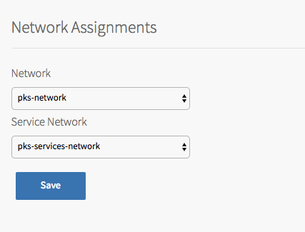

To configure the networks used by the {{  vars.product }} control plane:

1. Click **Assign Networks**.

    

1. Under **Network**, select the infrastructure subnet that you created for {{  vars.product }} component VMs, such as the TKGI API and TKGI Database VMs. For example, `infrastructure`.
1. Under **Service Network**, select the services subnet that you created for Kubernetes cluster VMs. For example, `services`.
1. Click **Save**.
