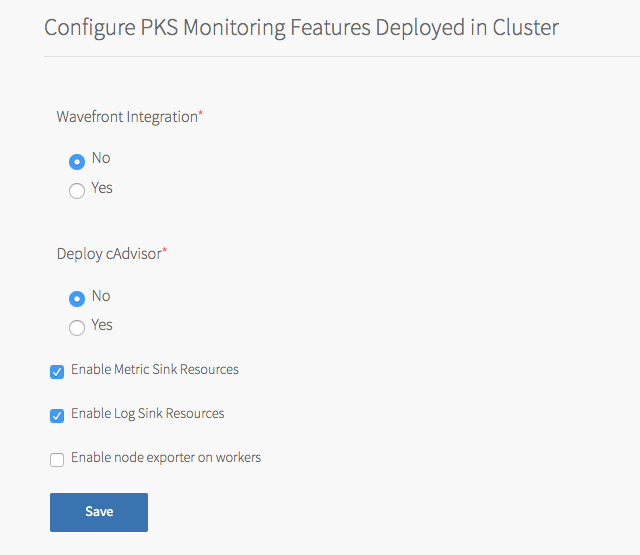
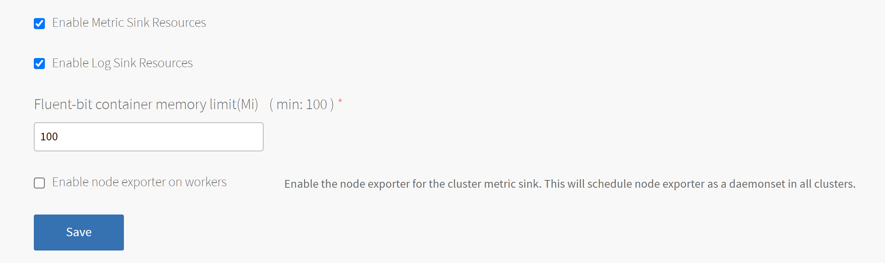

{{# evalExpression "vars.product_version == 'COMMENTED' "}}
{{{{raw}}}} <!--  WARNING!!!!  --> {{{{/raw}}}}
{{{{raw}}}} <!--  DO NOT ADD READBILITY LINE WRAPPING TO THIS CONTENT THE LONG LINES MUSt REMAIN TO CORRECTLY FORMAT THE FOLLOWING SECTION'S MARKDOWN CONTENT  --> {{{{/raw}}}}
{{{{raw}}}} <!--  <!-- WARNING!!!! -->  --> {{{{/raw}}}}
{{/ evalExpression }}

In **In-Cluster Monitoring**,  you can configure one or more observability
components and integrations that run in Kubernetes clusters and capture logs
and metrics about your workloads.
For more information, see
[Monitoring Workers and Workloads](in-cluster-monitoring.html).

To configure in-cluster monitoring:

{{# evalExpression "current_page.data.iaas == 'vSphere' || current_page.data.iaas == 'vSphere-NSX-T'"}}
* To configure cAdvisor, see
[VMware vRealize Operations Management Pack for Container Monitoring](#realize).
{{ else }}
* To configure cAdvisor, see [cAdvisor](#realize).
{{/ evalExpression }}
* To configure sink resources, see:
  * [Metric Sink Resources](#metric-sinks)
  * [Log Sink Resources](#log-sinks)

    You can enable both log and metric sink resources or only one of them.

{{# evalExpression "current_page.data.iaas == 'vSphere' || current_page.data.iaas == 'vSphere-NSX-T'"}}
#### VMware vRealize Operations Management Pack for Container Monitoring

You can monitor {{  vars.product }} Kubernetes clusters with VMware vRealize Operations Management Pack for Container Monitoring.

To integrate {{  vars.product }} with VMware vRealize Operations Management Pack for Container Monitoring, you must deploy a container running [cAdvisor](https://github.com/google/cadvisor) in your TKGI deployment.

cAdvisor is an open source tool that provides monitoring and statistics for Kubernetes clusters.

To deploy a cAdvisor container:

1. Select **In-Cluster Monitoring**.
1. Under **Deploy cAdvisor**, select **Yes**.
1. Click **Save**.

For more information about integrating this type of monitoring with TKGI, see the [VMware vRealize Operations Management Pack for Container Monitoring User Guide](https://techdocs.broadcom.com/us/en/vmware-cis/aria/aria-operations-for-integrations/2-2/vrealize--operations-management-pack--for-pack-for-kubernetes-2-2/getting-started-with-vmware-aria-operations-management-pack-for-kubernetes.html) and [Release Notes](https://techdocs.broadcom.com/us/en/vmware-cis/aria/aria-operations/8-18/Chunk1503020612.html) in the VMware documentation.
{{ else }}
#### cAdvisor

cAdvisor is an open source tool for monitoring, analyzing, and exposing Kubernetes container resource usage and performance statistics.

To deploy a cAdvisor container:

1. Select **In-Cluster Monitoring**.
1. Under **Deploy cAdvisor**, select **Yes**.
1. Click **Save**.

<strong>Note:</strong> For information about configuring cAdvisor to monitor your running Kubernetes containers, see
    <a href="https://github.com/google/cadvisor#cadvisor/">cAdvisor</a> in the cAdvisor GitHub repository.
    For general information about Kubernetes cluster monitoring, see
    <a href="https://kubernetes.io/docs/tasks/debug-application-cluster/resource-usage-monitoring/#resource-metrics-pipeline">Tools for Monitoring Resources</a>
    in the Kubernetes documentation.

{{/ evalExpression }}

#### Metric Sink Resources

You can configure TKGI-provisioned clusters to send Kubernetes node metrics and
pod metrics to metric sinks. For more information about metric sink resources
and what to do after you enable them in the tile, see
[Sink Resources](in-cluster-monitoring.html#sinks) in
_Monitoring Workers and Workloads_.

To enable clusters to send Kubernetes node metrics and pod metrics to metric
sinks:

1. In **In-Cluster Monitoring**, select **Enable Metric Sink Resources**.
If you enable this check box, {{  vars.product }} deploys Telegraf as a
`DaemonSet`, a pod that runs on each worker node in all your Kubernetes clusters.
1. (Optional) To enable Node Exporter to send worker node metrics to metric
sinks of kind `ClusterMetricSink`, select **Enable node exporter on workers**.
If you enable this check box, {{  vars.product }} deploys Node Exporter as
a `DaemonSet`, a pod that runs on each worker node in all your Kubernetes
clusters.

    For instructions on how to create a metric sink of kind `ClusterMetricSink`
    for Node Exporter metrics, see
    [Create a ClusterMetricSink Resource for Node Exporter Metrics](create-sinks.html#node-exporter) in _Creating and Managing Sink Resources_.
1. Click **Save**.

#### Log Sink Resources

You can configure TKGI-provisioned clusters to send Kubernetes API events and
pod logs to log sinks. For more information about log sink resources and what to
do after you enable them in the tile, see
[Sink Resources](in-cluster-monitoring.html#sinks) in
_Monitoring Workers and Workloads_.

To enable clusters to send Kubernetes API events and pod logs to log sinks:

1. Select **Enable Log Sink Resources**. If you enable this check box,
{{  vars.product }} deploys Fluent Bit as a `DaemonSet`, a pod that runs
on each worker node in all your Kubernetes clusters.
1. (Optional) To increase the Fluent Bit Pod memory limit, enter a value greater than 100 in the **Fluent-bit container memory limit(Mi)** field.

  

1. Click **Save**.

