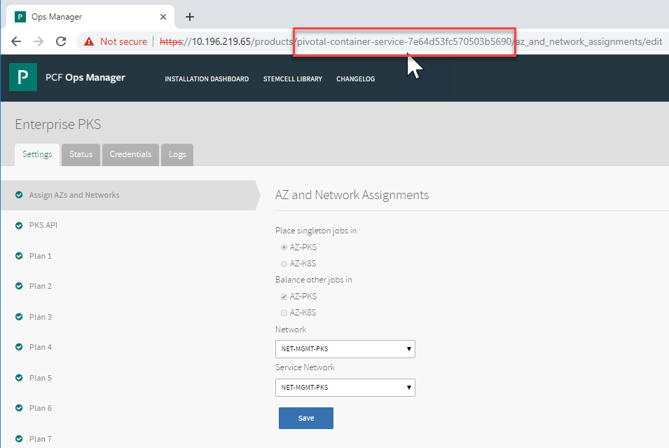
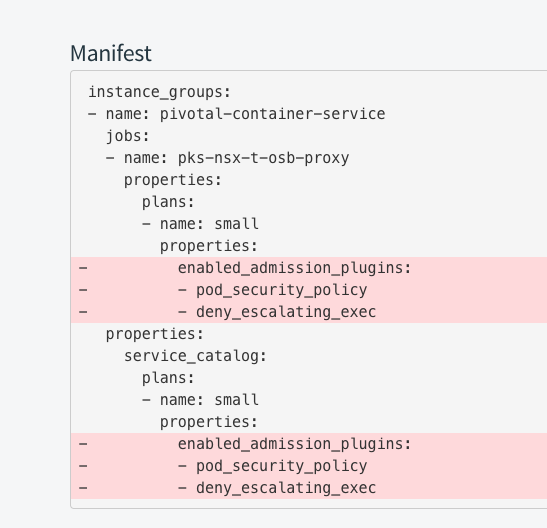

This topic describes how to deactivate {{  vars.product_full }} ({{ vars.product_short }}) cluster admission control plugins.

For more information about Admission Control Plugins, see [Using Admission Control Plugins for {{  vars.product }} Clusters](./admission-plugins.html).

##<a id='admission-plugin-disable-single'></a> Deactivating a Single Admission Control Plugin

To deactivate a single admission control plugin, do the following:

1. Log in to {{ vars.platform_name }}.
1. Click the {{  vars.product }} tile.
1. Select the plan where you configured the admission control plugin, such as **Plan 1**.
1. Deselect the admission control plugin.
1. Click **Save**.
1. In the **Errands** pane, verify that **Upgrade all clusters errand** is activated.
1. Return to **Installation Dashboard** and select **Review Pending Changes**.
1. Click **Apply Changes**.

Alternatively, instead of enabling **Upgrade all clusters errand**,
you can upgrade individual Kubernetes clusters through the TKGI Command Line Interface (TKGI CLI).
For instructions on upgrading individual Kubernetes clusters, see [Upgrading Clusters](upgrade-clusters.html).

##<a id='admission-plugin-disable'></a> Deactivating an Orphaned Admission Control Plugin

The {{ vars.platform_name }} UI does not let you deselect (deactivate) all admission control plugins.

In other words, after an admission control plugin is activated,
the {{ vars.platform_name }} UI requires that at least one admission control plugin check box is selected (activated).

To deactivate an orphaned Admission control Plugin, complete the following workflow:

1. Obtain the FQDN, user name, and password of your {{ vars.platform_name }}.
1. Authenticate into the {{ vars.platform_name }} API and retrieve a UAA access token to access {{ vars.platform_name }}.
    For more information, see [Using the {{ vars.platform_name }} API](https://techdocs.broadcom.com/us/en/vmware-tanzu/platform/tanzu-operations-manager/3-1/tanzu-ops-manager/install-ops-man-api.html).
1. Obtain the BOSH deployment name for the {{  vars.product }} tile by doing one of the following options:
    1. Option 1: Use the {{ vars.platform_name }} API:
        1. In a terminal, run the following command:

            ```
            curl -i "https://OPS-MAN-FQDN/api/v0/staged/products" -X GET -H "Authorization: Bearer UAA-ACCESS-TOKEN" -k
            ```
        1. In the output, locate the `installation_name` that begins with `pivotal-container-service`.
        1. Copy the entire BOSH deployment name, including the unique GUID. For example, `pivotal-container-service-4b48fc5b704d54c6c7de`.
    1. Option 2: Use the {{ vars.platform_name }} UI:
        1. In {{ vars.platform_name }}, click the {{  vars.product }} tile.
        1. Copy the BOSH deployment name including the GUID from the URL:

            
            <br/><br/>
            The deployment name contains "pivotal-container-service" and a unique GUID string. For example, `pivotal-container-service-4b48fc5b704d54c6c7de`.
1. To deactivate the orphaned admission control plugin, run the following {{ vars.platform_name }} API command:

    ```
    curl -i "https://OPS-MAN-FQDN/api/v0/staged/pivotal-container-service-GUID/properties" \
    -H "Authorization: Bearer UAA-ACCESS-TOKEN" \
    -X PUT -d '{"properties": {".properties.PLAN-NUMBER_selector.active.admission_plugins":{"value":[]}}}' \
    -H "Content-Type: application/json"
	```
    Where:

	   * `OPS-MAN-FQDN` is the URL of your {{ vars.platform_name }}.
	   * `pivotal-container-service-GUID` is the BOSH deployment name of your {{  vars.product }} that you retrieved earlier in this procedure.
	   * `UAA-ACCESS-TOKEN` is the UAA token you retrieved earlier in this procedure.
       * `PLAN-NUMBER` is the plan configuration you want to update. For example, `plan1` or `plan2`.

	For example:
	```console
	 $ curl -i "https://pcf.example.com/api/v0/staged/products/pivotal-container-service-4b48fc5b704d54c6c7de/properties" \
     -H "Authorization: Bearer aBcdEfg0hIJKlm123.e" \
     -X PUT -d '{"properties": {".properties.plan1_selector.active.admission_plugins":{"value":[]}}}' \
     -H "Content-Type: application/json"
    ```

1. From the output, verify that the command returns a `HTTP 200` status code.
1. Validate your manifest change in the {{ vars.platform_name }} UI. Do the following:
    1. Log in to {{ vars.platform_name }}.
    1. Select **Review Pending Changes**.
    1. On the Review Pending Changes pane, navigate to the {{  vars.product }} section and select **SEE CHANGES**.
    1. Verify that the admission control plugins are displayed as removed in the **Manifest** section. For example:

        

1. Click **Apply Changes**.
