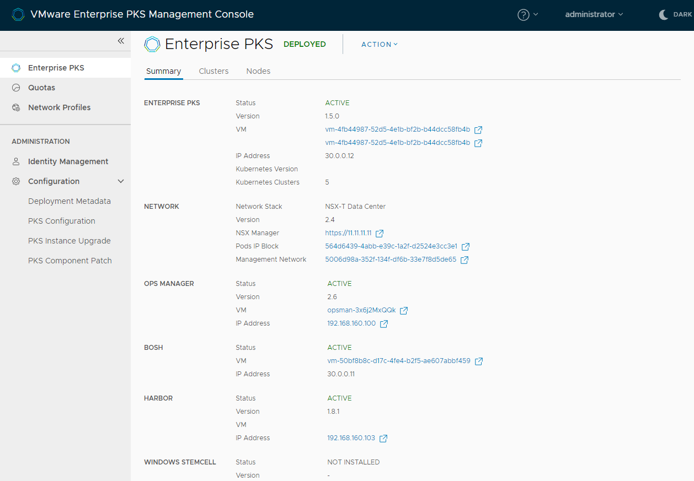
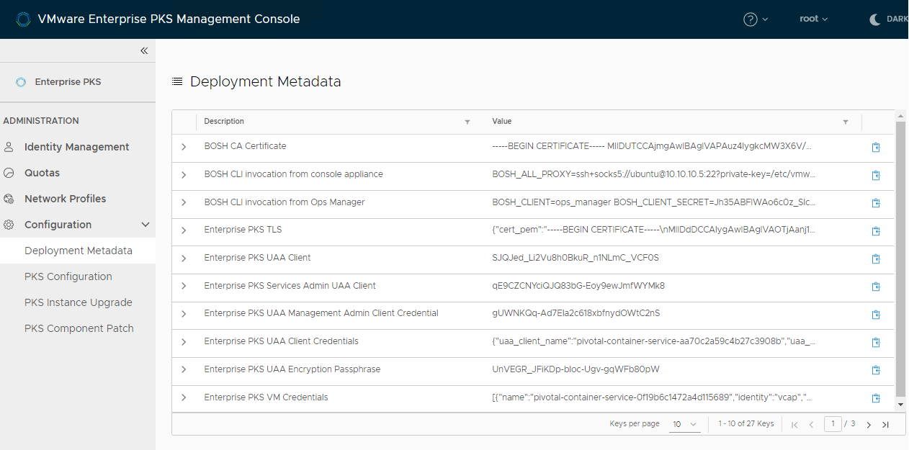
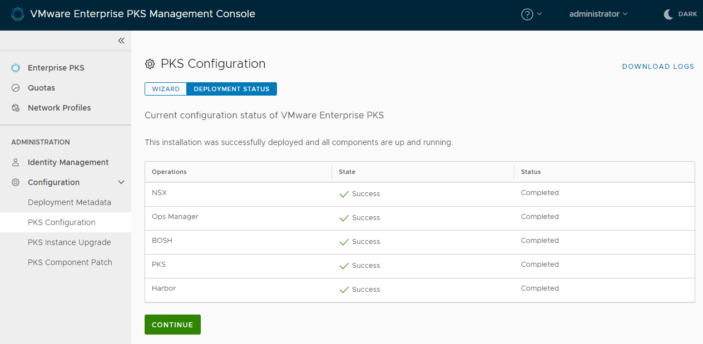

After you have deployed {{  vars.product_full }} on vSphere, you can use {{  vars.product_full }} Management Console to perform the following operations:

- View the [overall status](#general-status) of your deployment.
- View the [deployment metadata](#metadata) and [status](#component-status) of each of the components of your deployment.
- Edit the configuration of your deployment, either in the configuration wizard or by editing the YAML file. For information about reconfiguring your deployment, see [Reconfigure Your {{  vars.product }} Deployment](console-reconfigure.html).
- Upgrade your deployment to a new version. For information about upgrading deployments, see [Upgrade {{  vars.product }} Management Console](console-upgrade.html).
- Patch the individual components of your deployment. For information about patching components, see [Patch {{  vars.product }} Management Console Components](console-patch-components.html).
- [Delete Your {{  vars.product }} Deployment](console-delete-deployment.html).

For information about how to deploy the management console and install {{  vars.product }}, see [Install on vSphere with the Management Console](console-install-vsphere.html).

## Obtain General Status Information

1. Go to the **TKG Integrated Edition** view of the management console.
1. Select the **Summary** tab for your {{  vars.product }} instance.
 You see general information about your deployment, including the status and version of each component, as well as the names and addresses of the VMs that run those services.
    
    [View a larger version of this image](images/console/deployment-summary.png)

## Obtain Deployment Metadata

The deployment metadata provides credentials, certificates, and other metadata about your {{  vars.product }} deployment.

1. Expand **Configuration** and select **Deployment Metadata**.
    
    [View a larger version of this image](images/console/deployment-metadata.png)
1. Select the clipboard icon at the end of each row to copy the relevant value.

    For example, copy the {{ vars.platform_name }} password so that you can log in to the instance of {{ vars.platform_name }} that is running in your deployment.

## View Component Deployment Status

You can see the status of the individual components of your deployment.

1. Expand **Configuration** and go to the **TKGI Configuration** view of the management console.
1. Select **Deployment Status** to see the status of the components.

    
    [View a larger version of this image](images/console/deployment-complete.png)

1. Click the Download Logs button to download the log bundle for your {{  vars.product }} deployment.
