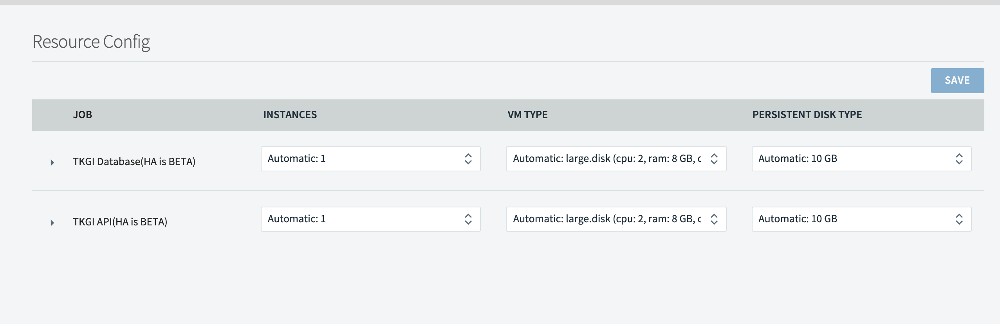

This topic describes how {{  vars.product_full }} deploys and manages Kubernetes clusters.

## {{  vars.product }} Overview

A {{  vars.product }} environment consists of a {{ vars.product_short }} Control Plane
and one or more workload clusters.

{{  vars.product }} administrators use the {{ vars.product_short }} Control Plane to
deploy and manage Kubernetes clusters. The workload clusters run the apps pushed by developers.

The following illustrates the interaction between {{  vars.product }} components:
 
{{ image_tag src="images/tkgi-overview-ha.png" alt="HA {{ vars.product_short }} Control Plane with HA {{ vars.product_short }} API VM Group and HA DB VM cluster" }}
{{{{raw}}}} <!--  Image source: https://docs.google.com/drawings/d/1TZkaTSCiddEE7mZtOTjTg6jBuDAy0D3CI9JY56HBIAY/edit  --> {{{{/raw}}}}

Administrators access the {{ vars.product_short }} Control Plane
through the {{ vars.product_short }} Command Line Interface ({{ vars.product_short }} CLI) installed on their local workstations.

Within the {{ vars.product_short }} Control Plane the {{ vars.product_short }} API and {{ vars.product_short }} Broker use BOSH to execute the requested cluster management functions.
For information about the {{ vars.product_short }} Control Plane, see [{{ vars.product_short }} Control Plane Overview](#control-plane) below.
For instructions on installing the {{ vars.product_short }} CLI, see [Installing the {{ vars.product_short }} CLI](installing-cli.html).

Kubernetes deploys and manages workloads on Kubernetes clusters.
Administrators use the  Kubernetes CLI, `kubectl`, to direct Kubernetes
from their local workstations.
For information about `kubectl`, see [Overview of kubectl](https://kubernetes.io/docs/reference/kubectl/overview/) in the Kubernetes documentation.

## {{ vars.product_short }} Control Plane Overview

The {{ vars.product_short }} Control Plane manages the lifecycle of Kubernetes clusters deployed
using {{  vars.product }}.

The control plane provides the following via the {{ vars.product_short }} API:

* View cluster plans
* Create clusters
* View information about clusters
* Obtain credentials to deploy workloads to clusters
* Scale clusters
* Delete clusters
* Create and manage network profiles for VMware NSX

In addition, the {{ vars.product_short }} Control Plane can upgrade all existing clusters using the **Upgrade all clusters** BOSH errand.
For more information, see [Upgrade Kubernetes Clusters](upgrade.html#upgrade-instances) in _Upgrading {{  vars.product }} (Antrea Networking)_.

 
{{ vars.product_short }} Control Plane is hosted on a pair of VM groups:

* The [{{ vars.product_short }} API VM Group](#tkgi-api-vm) for hosting cluster management services.
* The [{{ vars.product_short }} Database VM Cluster](#tkgi-db-vm) to store cluster management data.

###{{ vars.product_short }} API VM Group

The instances in the {{ vars.product_short }} API VM Group host the following services:

* User Account and Authentication (UAA)
* {{ vars.product_short }} API
* {{ vars.product_short }} Broker
* Billing and Telemetry

The following sections describe UAA, {{ vars.product_short }} API, and {{ vars.product_short }} Broker services,
the primary services hosted on the {{ vars.product_short }} API VM.

#### UAA

When a user logs in to or logs out of the {{ vars.product_short }} API through the {{ vars.product_short }} CLI, the {{ vars.product_short }} CLI communicates with UAA to authenticate them.
The {{ vars.product_short }} API permits only authenticated users to manage Kubernetes clusters.
For more information about authenticating, see [{{ vars.product_short }} API Authentication](api-auth.html).

UAA must be configured with the appropriate users and user permissions.
For more information, see [Managing {{  vars.product }} Users with UAA](manage-users.html).

#### {{ vars.product_short }} API

Through the {{ vars.product_short }} CLI, users instruct the {{ vars.product_short }} API service to deploy, scale up, and delete Kubernetes clusters as well as show cluster details and plans.
The {{ vars.product_short }} API can also write Kubernetes cluster credentials to a local kubeconfig file, which enables users to connect to a cluster through `kubectl`.

On AWS and vSphere without NSX, the {{ vars.product_short }} CLI communicates with the
{{ vars.product_short }} API within the control plane via the {{ vars.product_short }} API Load Balancer.
On vSphere with NSX deployments the {{ vars.product_short }} API host is accessible via a DNAT rule.
For information about enabling the {{ vars.product_short }} API on vSphere with NSX, see the
[Share the {{ vars.product_short }} API Endpoint](installing-nsx-t.html#retrieve-endpoint) section in
_Installing {{  vars.product }} on vSphere with NSX Integration_.

The {{ vars.product_short }} API sends all cluster management requests, except read-only requests, to the {{ vars.product_short }} Broker.

#### {{ vars.product_short }} Broker

When the {{ vars.product_short }} API receives a request to modify a Kubernetes cluster, it instructs the {{ vars.product_short }} Broker to make the requested change.

The {{ vars.product_short }} Broker consists of an [On-Demand Service Broker](https://techdocs.broadcom.com/us/en/vmware-tanzu/platform-services/on-demand-services-sdk-for-tanzu/0-42.html) and a Service Adapter. The {{ vars.product_short }} Broker generates a BOSH manifest and instructs the BOSH Director to deploy or delete the Kubernetes cluster.

For {{  vars.product }} deployments on vSphere with NSX, there is an additional component, the {{  vars.product }} NSX Proxy Broker.
The {{ vars.product_short }} API communicates with the {{ vars.product_short }} NSX Proxy Broker, which in turn communicates with the NSX Manager to provision the Node Networking resources.
The {{ vars.product_short }} NSX Proxy Broker then forwards the request to the On-Demand Service Broker to deploy the cluster.

### {{ vars.product_short }} Database VM Cluster

The instances in the {{ vars.product_short }} Database VM Cluster host MySQL, proxy, and other data-related services.
These data-related functions persist {{ vars.product_short }} Control Plane data for the the following services:

* {{ vars.product_short }} API
* UAA
* Billing
* Telemetry

## High Availability Modes

{{  vars.product }} can be configured for {{ vars.product_short }} Control Plane and workload high availability.

####{{ vars.product_short }} Control Plane High Availability Mode

The {{ vars.product_short }} Control Plane can be configured in either standard or high availability modes.

* In standard mode:
    * The {{ vars.product_short }} API is hosted on the `pivotal-container-service` VM.
    * The {{ vars.product_short }} Database is hosted on the `pks-db` VM.
* In high availability mode:
    * The {{ vars.product_short }} API is hosted on multiple `pivotal-container-service` VMs.
    * The {{ vars.product_short }} Database is hosted on three `pks-db` VMs.

The following illustrates the interaction between {{  vars.product }} components in high availability mode:
 
{{ image_tag src="images/tkgi-overview-ha.png" alt="HA {{ vars.product_short }} Control Plane with HA {{ vars.product_short }} API VM Group and HA DB VM cluster" }}
{{{{raw}}}} <!--  Image source: https://docs.google.com/drawings/d/1hTTmoBpkcjvZJTwlwsXMy9fn91x3KGfIeM4_dzIrW60/edit  --> {{{{/raw}}}}

You establish HA mode during the resource configuation phase of {{ vars.product_short }} tile deployment. You can change the number of instances from 1 to 2 or 3 for the {{ vars.product_short }} API, and from 1 to 3 for the {{ vars.product_short }} Database. Once you set HA mode and increase the number of instances beyond 1, you cannot decrease the number of instances.

  

##Windows Worker-Based Kubernetes Cluster High Availability

Windows worker-based cluster Linux nodes can be configured in either standard or high availability modes.

* In standard mode, a single control plane/etcd node and a single Linux worker manage a cluster's Windows Kubernetes VMs.
* In high availability mode,
multiple control plane/etcd and Linux worker nodes manage a cluster's Windows Kubernetes VMs.

The following illustrates the interaction between the
{{  vars.product }} Management Plane and Windows worker-based Kubernetes clusters:
 
{{ image_tag src="images/overview-windows-ha-linux-workers.png" alt="HA Windows worker clusters include HA ETCD Nodes that communicate out to a BOSH VM and internally to HA Linux workers that communicate with Windows Kubernetes nodes" }}
{{{{raw}}}} <!--  Image source: https://docs.google.com/drawings/d/1ec0T8iZx3P8Uf-dxnl1dLesuvtabTwapXClf2kxZ3qA/edit  --> {{{{/raw}}}}
 
To configure {{  vars.product }} Windows worker-based clusters for high availability, set these fields in the **Plan** pane as described in [Plans](windows-workers.html#plans) in _Configuring Windows Worker-Based Kubernetes Clusters_:

* **Enable HA Linux workers**
* **Master/ETCD Node Instances**
* **Worker Node Instances**
