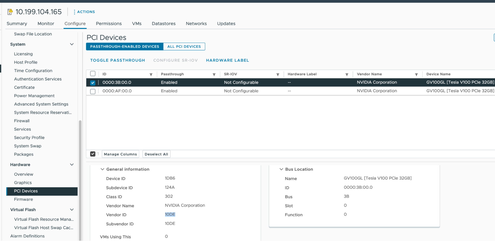

# Create GPU Clusters with CUDA

This page explains how to create TKGI clusters on vSphere with NVIDIA GPU worker nodes and Compute Unified Device Architecture (CUDA) enabled for hosted applications.

## <a id="overview"></a> Overview

To create a CUDA-enabled GPU cluster with TKGI on vSphere, you:

1. Plug compatible GPU cards into your ESXi hosts.
1. Configure PCI passthrough for the cards, and retrieve the `vendor_id` and `device_id` that identify them.
1. Configure a BOSH VM Extension for a VM instance group that uses the GPUs, as set by `pci_passthroughs`.
1. (Optional) To enable the cluster to run workloads on either non-GPU or GPU processors, configure a compute profile that defines both non-GPU and GPU node pools.
1. Create the cluster.
1. Install the [NVIDIA GPU Operator](https://docs.nvidia.com/datacenter/cloud-native/gpu-operator/latest/overview.html) on the cluster to integrate the GPU with Kubernetes.
  - By default, the NVIDIA GPU Operator installs a default GPU driver on worker nodes, but you can also customize the GPU driver image.


## <a id="prereqs"></a> Prerequisites

* TKGI v1.20 or later.
* NVIDIA GPU cards from G8x series or later, such as GeForce, Quadro, or Tesla
  * These cards support CUDA.
* ESXi hosts running vSphere 7.0 Update 3 or later. Listed below are the builds for 7.0u3 which is the minimum required to support this.
  * [VMware vCenter Server 7.0 Update 3 | ISO Build 18700403](https://docs.vmware.com/en/VMware-vSphere/7.0/rn/vsphere-vcenter-server-703-release-notes.html).
  * [VMware ESXi 7.0 Update 3c | ISO Build 19193900](https://docs.vmware.com/en/VMware-vSphere/7.0/rn/vsphere-esxi-70u3c-release-notes.html).
* Helm, the Kubernetes package manager. To install, see [Installing Helm](https://helm.sh/docs/intro/install/) in the Helm documentation.


## <a id="prep"></a> Prepare the Hardware

To prepare GPU hardware for supporting TKGI clusters with CUDA:

1. Plug a GPU card into each ESXi host.
  - To simplify management, VMware recommends grouping the hosts that have GPUs into the same cluster, so they run within a single availability zone (AZ).

1. Enable PCI passthrough and record the GPU IDs:
   1. In your vSphere Client, select the target ESXi host in the `GPU` cluster.
   1. Select **Configure > Hardware > PCI Devices**.
   1. Select the **All PCI Devices** tab.
   1. For each target GPU:

      1. Select the GPU from the list.
      1. Click **Toggle Passthrough**.
      1. Under **General Information**, record the **Vendor ID** and **Device ID**. Both IDs are the same for identical GPU cards.



## <a id="extension"></a> Configure the BOSH VM Extension

You configure a Kubernetes cluster to have GPU-based workers by defining an instance group with VM extensions `vm_extensions.pci_passthroughs.vendor_id` and `.device_id` set to your GPU's vendor and device ID values.
See [Using BOSH VM Extensions](bosh-vm-extensions.html) for how to create the VM extension.

The instance group's `name` value must start with `worker-`, to specify that it applies to worker nodes.

You can define the instance groups using either YAML or JSON format.
The formats differ in how you set the ID values:

* YAML: Hexadecimal, e.g. `0x10de`; prepend `0x` to the vSphere client listing
* JSON: Decimal, e.g. `4318`; convert from the vSphere client listing

For example:

* **YAML**:

  ```
  ---
  instance_groups:
  - name: master
    vm_extension:
      vmx_options:
        disk.enableUUID: '1'
  - name: worker-gpu-pool
    vm_extension:
      cpu: 8
      ram: 16384
      pci_passthroughs:
      - vendor_id: 0x10de
        device_id: 0x1db6
      vmx_options:
        disk.enableUUID: '1'
        pciPassthru.use64bitMMIO: 'TRUE'
        pciPassthru.64bitMMIOSizeGB: 128
  ```

* **JSON**:

  ```
  {
      "instance_groups": [
          {
              "name": "master",
              "vm_extension": {
                  "vmx_options": {
                      "disk.enableUUID": "1"
                  }
              }
          },
          {
              "name": "worker-gpu-pool",
              "vm_extension": {
                  "cpu": 8,
                  "ram": 16384,
                  "pci_passthroughs": [
                      {
                          "vendor_id": 4318,
                          "device_id": 7606
                      }
                  ],
                  "vmx_options": {
                      "disk.enableUUID": "1",
                      "pciPassthru.use64bitMMIO": "TRUE",
                      "pciPassthru.64bitMMIOSizeGB": 128
                  }
              }
          }
      ]
  }
  ```

Configure the `pci_passthroughs` and `vmx_options` sections as described below.

### <a id="pci"></a> `pci_passthroughs`

To support the GPU worker nodes, you need a sufficient number of GPUs:

```
Total GPUs needed = Number of GPUs in the vm_extension * Number of workers in the GPU node pool
```

For example, if you have two GPUs on every ESXi host that is hosting GPU workers, you can set `pci_passthroughs` to specify both of them, using the vendor and device ID for each:

```
    pci_passthroughs:
    - vendor_id: 0x10de
      device_id: 0x1db6 
    - vendor_id: 0x10de
      device_id: 0x1db6
```

The IDs are the same for identical GPU boards, but you need to list them by the correct count.

### <a id="vmx"></a> `vmx_options`

The `vmx_options` sets extra properties for the GPU worker, for example:

- `pciPassthru.use64bitMMIO: ‘TRUE’` - set this for GPUs that require 16GB or more of
memory mapping
- `pciPassthru.64bitMMIOSizeGB: 128` - set this option to the size of memory
mapped I/O (MMIO).
  - Calculate this value by adding up the total GB of framebuffer memory on all GPUs attached to the VM, and set it to the next power of 2 above the total. For example, if all attached GPUs use 50GB, set this to 64GB.

## <a id="cp"></a> (Optional) Configure Compute Profile

To create a Kubernetes cluster with both GPU and non-GPU worker nodes, configure a compute profile that defines two node pools, one for each worker type, as described in [Using Compute Profiles (vSphere)](compute-profiles-use.md).

Without a compute profile, the cluster you create will only have GPU workers.

For example:

  ```
  {
      "name": "gpu-compute-profile",
      "description": "gpu-compute-profile",
      "parameters": {
          "cluster_customization": {
              "node_pools": [
                  {
                      "name": "normal-pool",
                      "instances": 3,
                      "max_worker_instances": 5
                  },
                  {
                      "name": "gpu-pool",
                      "instances": 3,
                      "max_worker_instances": 5
                  }
              ]
          }
      }
  }
  ```

  Where the `node_pools.name` value is the name of the VM extension without the `worker-` prefix.


## <a id="create"></a>Create the Cluster

How you create the cluster depends on whether you defined a compute profile:

* **With compute profile**:

  1. Create the compute profile:

      ```
      tkgi create-compute-profile  ~/work/x/tkgi-gpu/src/tkgi/gpu-compute-profile.json
      ```

  1. Create the cluster with the profile:

      ```
      tkgi create-cluster my-gpu-cluster \
       --external-hostname my-gpu-cluster.example.com \
      --plan small \
      --compute-profile < compute profile defined above > \
      --config-file < path to the vm_extension file save above >
      ```

* **No compute profile**:

  1. Create the GPU-only cluster:

      ```
       tkgi create-cluster my-gpu-cluster \
       --external-hostname my-gpu-cluster.example.com \
      --plan small \
      --config-file < path to the vm_extension file save above >
      ```


## <a id="operator"></a>Install the GPU Operator

To enable GPU integration with the Kubernetes environment, NVIDIA
provides a [GPU Operator](https://docs.nvidia.com/datacenter/cloud-native/gpu-operator/latest/overview.html) Helm chart for managing GPUs.
This Kubernetes operator handles GPU driver lifecycle management, node labeling, container-toolkit installation, etc.

To install the GPU Operator in your TKGI GPU cluster, see [Installing the NVIDIA GPU Operator](https://docs.nvidia.com/datacenter/cloud-native/gpu-operator/latest/getting-started.html#operator-install-guide) in the NVIDIA documentation.

For Helm chart customization options, see [Common Chart Customization Options](https://docs.nvidia.com/datacenter/cloud-native/gpu-operator/latest/getting-started.html#chart-customization-options).

For example, a typical installation might go like this:

1. Install Helm, if not already installed:

  ```
  curl -fsSL -o get_helm.sh https://raw.githubusercontent.com/helm/helm/master/scripts/get-helm-3 \
    && chmod 700 get_helm.sh \
    && ./get_helm.sh
  ```

1. Add the NVIDIA Helm repository:

  ```
  helm repo add nvidia https://helm.ngc.nvidia.com/nvidia \
    && helm repo update
  ```

1. Install the GPU Operator:

  ```
  helm install --wait --generate-name \
    -n gpu-operator --create-namespace \
    nvidia/gpu-operator \
      --set driver.enabled=true \
      --set toolkit.enabled=true \
      --set toolkit.env[0].name=CONTAINERD_CONFIG \
      --set toolkit.env[0].value=/var/vcap/jobs/containerd/config/config.toml \
      --set toolkit.env[1].name=CONTAINERD_SOCKET \
      --set toolkit.env[1].value=/var/vcap/sys/run/containerd/containerd.sock \
      --set toolkit.env[2].name=CONTAINERD_RUNTIME_CLASS \
      --set toolkit.env[2].value=nvidia \
      --set toolkit.env[3].name=CONTAINERD_SET_AS_DEFAULT \
      --set-string toolkit.env[3].value="true"
  ```

### <a id="custom"></a> Customize the Driver Image

If the default GPU driver does not work or suit your needs, you can install custom one as described in [Running a Custom Driver Image](https://docs.nvidia.com/datacenter/cloud-native/gpu-operator/latest/getting-started.html#running-a-custom-driver-image) in the NVIDIA documentation.

If you use a custom driver, you need to add the `driver.repository` and `driver.version` options you install the gpu-operator.

## <a id="resources"></a> Resources

- [<u>GPU Device in PCI
  Passthrough</u>](https://docs.vmware.com/en/VMware-Edge-Compute-Stack/3.0/ecs-enterprise-edge-ref-arch/GUID-412AD9B3-6B9B-4BE0-B833-9205ACBCF956.html)

- [<u>64bitMMIOSizeGB</u>](https://earlruby.org/2022/02/calculating-the-value-for-64bitmmiosizegb/)

- [<u>PCI
  passthrough</u>](https://knowledge.broadcom.com/external/article/312208/vsphere-vmdirectpath-io-and-dynamic-dire.html)
