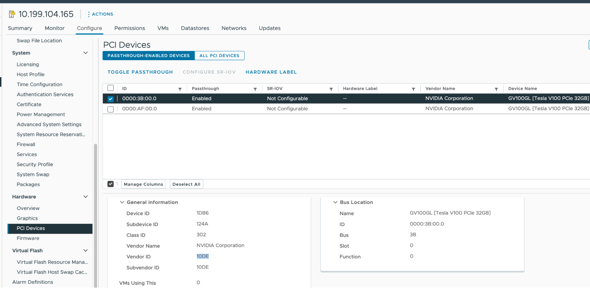

# Create GPU Clusters

This page explains how to create TKGI clusters on vSphere that run NVIDIA GPU worker nodes.
Applications hosted on GPU clusters access GPU functionality via Compute Unified Device Architecture (CUDA).

To run NVIDIA vGPU worker nodes, see [Create vGPU Clusters](vgpu.html).

VMware ESXi hosts let VMs directly access plugged-in GPU hardware via PCI passthrough as described in [GPU Device in PCI Passthrough](https://docs.vmware.com/en/VMware-Edge-Compute-Stack/3.0/ecs-enterprise-edge-ref-arch/GUID-412AD9B3-6B9B-4BE0-B833-9205ACBCF956.html) in the VMware Edge documentation.


## <a id="overview"></a> Overview

To create a CUDA-enabled GPU cluster with TKGI on vSphere, you:

1. Plug compatible GPU cards into your ESXi hosts.
1. Configure PCI passthrough for the cards, and retrieve the `vendor_id` and `device_id` that identify them.
1. Configure a BOSH VM Extension for a VM instance group that uses the GPUs, as set by `pci_passthroughs`.
1. (Optional) To enable the cluster to run workloads on either non-GPU or GPU processors, configure a compute profile that defines both non-GPU and GPU node pools.
1. Create the cluster.
1. Install the [NVIDIA GPU Operator](https://docs.nvidia.com/datacenter/cloud-native/gpu-operator/latest/overview.html) on the cluster to integrate the GPU with Kubernetes.
  - By default, the NVIDIA GPU Operator installs a default GPU driver on worker nodes, but you can also customize the GPU driver image.


## <a id="prereqs"></a> Prerequisites

* TKGI v1.20 or later
* NVIDIA GPU cards from G8x series or later, such as GeForce, Quadro, or Tesla
  * These cards support CUDA.
* ESXi hosts running vSphere 7.0 Update 3 or later
  * For ESXi I/O requirements, see [vSphere VMDirectPath I/O and Dynamic DirectPath I/O: Requirements for Platforms and Devices](https://knowledge.broadcom.com/external/article/312208/) in the Broadcom Support Knowledge Base.
  * Listed below are the builds for 7.0u3, which is the minimum required to support GPU clusters.
      * [VMware vCenter Server 7.0 Update 3 | ISO Build 18700403](https://docs.vmware.com/en/VMware-vSphere/7.0/rn/vsphere-vcenter-server-703-release-notes.html).
      * [VMware ESXi 7.0 Update 3c | ISO Build 19193900](https://docs.vmware.com/en/VMware-vSphere/7.0/rn/vsphere-esxi-70u3c-release-notes.html)


## <a id="hardware"></a> Prepare the Hardware

To prepare GPU hardware for supporting TKGI clusters with CUDA:

1. Plug the GPU cards into your ESXi hosts.
  - To simplify management, VMware recommends grouping the hosts that have GPUs into the same vSphere cluster, so they run within a single availability zone (AZ).

1. Install NVIDIA software for GPU as described in the [Enable PCI Passthrough](#pci-passthrough) subsection below.
  - PCI passthrough software for GPU and software for vGPU are mutually exclusive; on any ESXi host, you can deploy clusters with GPU workers or vGPU workers, but not both.

### <a id="pci-passthrough"></a> Enable PCI Passthrough

To prepare NVIDIA hardware for GPU, enable PCI passthrough and record the GPU IDs:

1. In your vSphere Client, select the target ESXi host in the `GPU` cluster.
1. Select **Configure > Hardware > PCI Devices**.
1. Select the **All PCI Devices** tab.
1. For each target GPU:

  1. Select the GPU from the list.
  1. Click **Toggle Passthrough**.
  1. Under **General Information**, record the **Vendor ID** and **Device ID**. Both IDs are the same for identical GPU cards.

  


## <a id="extension"></a> Configure BOSH VM Extension

You configure a Kubernetes cluster to have GPU-based workers by defining an instance group with VM extensions `vm_extensions.pci_passthroughs.vendor_id` and `.device_id` set to your GPU's vendor and device ID values.
See [Using BOSH VM Extensions](bosh-vm-extensions.html) for how to create the VM extension.

The instance group's `name` value must start with `worker-`, to specify that it applies to worker nodes.

You can define the instance groups using either YAML or JSON format.
The formats differ in how you set the ID values:

* YAML: Hexadecimal, e.g. `0x10de`; prepend `0x` to the vSphere client listing
* JSON: Decimal, e.g. `4318`; convert from the vSphere client listing

For example:

* **YAML**:

  ```
  ---
  instance_groups:
  - name: master
    vm_extension:
      vmx_options:
        disk.enableUUID: '1'
  - name: worker-gpu-pool
    vm_extension:
      cpu: 8
      ram: 16384
      pci_passthroughs:
      - vendor_id: 0x10de
        device_id: 0x1db6
      vmx_options:
        disk.enableUUID: '1'
        pciPassthru.use64bitMMIO: 'TRUE'
        pciPassthru.64bitMMIOSizeGB: 128
  ```

* **JSON**:

  ```
  {
      "instance_groups": [
          {
              "name": "master",
              "vm_extension": {
                  "vmx_options": {
                      "disk.enableUUID": "1"
                  }
              }
          },
          {
              "name": "worker-gpu-pool",
              "vm_extension": {
                  "cpu": 8,
                  "ram": 16384,
                  "pci_passthroughs": [
                      {
                          "vendor_id": 4318,
                          "device_id": 7606
                      }
                  ],
                  "vmx_options": {
                      "disk.enableUUID": "1",
                      "pciPassthru.use64bitMMIO": "TRUE",
                      "pciPassthru.64bitMMIOSizeGB": 128
                  }
              }
          }
      ]
  }
  ```

Configure the `pci_passthroughs` block as described below, and `vmx_options` as described in [`vmx_options` Extension Options](#vmx).

### <a id="pci"></a> `pci_passthroughs`

To support the GPU worker nodes, you need a sufficient number of GPUs:

```
Total GPUs needed = Number of GPUs in the vm_extension * Number of workers in the GPU node pool
```

For example, if you have two GPUs on every ESXi host that is hosting GPU workers, you can set `pci_passthroughs` to specify both of them, using the vendor and device ID for each:

```
    pci_passthroughs:
    - vendor_id: 0x10de
      device_id: 0x1db6 
    - vendor_id: 0x10de
      device_id: 0x1db6
```

The IDs are the same for identical GPU boards, but you need to list them by the correct count.

## <a id="cp"></a> (Optional) Configure Compute Profile

To create a Kubernetes cluster with both GPU and non-GPU worker nodes, configure a compute profile and custom AZs that define separate node pools, one for each worker type, as described in [Create a Compute Profile](compute-profiles-manage.html#create).

Without a compute profile, the cluster you create will only have GPU workers.

For example, to use a node pool `gpu-pool` in AZ `gpu-az`, create a compute profile spec `gpu-compute-profile.json` with:

  ```
  {
      "name": "gpu-compute-profile",
      "description": "gpu-compute-profile",
      "parameters": {
          "azs": [{
              "name": "gpu-az",
                [...]
                }]
              }
            }
          ],
          "cluster_customization": {
              "node_pools": [
                  {
                      "name": "normal-pool",
                      "instances": 3,
                      "max_worker_instances": 5
                  },
                  {
                      "name": "gpu-pool",
                      "az_names": ["gpu-az"],
                      "instances": 3,
                      "max_worker_instances": 5
                  }
              ]
          }
      }
  }
  ```

  Where the `node_pools.name` value is the name of the VM extension without the `worker-` prefix.

> **Note** Do not use multiple GPU profiles on a worker. If you need a GPU with 8G memory, use an 8G profile, not two 4G profiles.

## <a id="create"></a>Create GPU Cluster

How you create the cluster depends on whether you defined a compute profile:

* **With compute profile**:

  1. Create the compute profile:

      ```
      tkgi create-compute-profile  ~/work/x/tkgi-gpu/src/tkgi/gpu-compute-profile.json
      ```

  1. Create the cluster with the profile:

      ```
      tkgi create-cluster my-gpu-cluster \
       --external-hostname my-gpu-cluster.example.com \
      --plan small \
      --compute-profile < compute profile defined above > \
      --config-file < path to the vm_extension file save above >
      ```

* **No compute profile**:

  1. Create the GPU-only cluster:

      ```
       tkgi create-cluster my-gpu-cluster \
       --external-hostname my-gpu-cluster.example.com \
      --plan small \
      --config-file < path to the vm_extension file save above >
      ```


## <a id="operator"></a>Install GPU Kubernetes Operator

To enable GPU integration with the Kubernetes environment, NVIDIA
provides a [GPU Operator](https://docs.nvidia.com/datacenter/cloud-native/gpu-operator/latest/overview.html) Helm chart for managing GPUs.
This Kubernetes operator handles GPU driver lifecycle management, node labeling, container-toolkit installation, etc.

See [Supported NVIDIA Data Center GPUs and Systems](https://docs.nvidia.com/datacenter/cloud-native/gpu-operator/latest/platform-support.html#supported-nvidia-data-center-gpus-and-systems) in the NVIDIA documentation to determine whether the GPU Operator supports your hardware and environment.

To install the GPU Operator in your TKGI GPU cluster, see [Installing the NVIDIA GPU Operator](https://docs.nvidia.com/datacenter/cloud-native/gpu-operator/latest/getting-started.html#operator-install-guide) in the NVIDIA documentation.

For Helm chart customization options, see [Common Chart Customization Options](https://docs.nvidia.com/datacenter/cloud-native/gpu-operator/latest/getting-started.html#chart-customization-options).

In a typical installation for example, you might run the following on the local workstation where you have `kubectl` installed:

1. Install Helm, if not already installed:

  ```
  curl -fsSL -o get_helm.sh https://raw.githubusercontent.com/helm/helm/master/scripts/get-helm-3 \
    && chmod 700 get_helm.sh \
    && ./get_helm.sh
  ```

1. Add the NVIDIA Helm repository:

  ```
  helm repo add nvidia https://helm.ngc.nvidia.com/nvidia \
    && helm repo update
  ```

1. Install the GPU Operator:

  ```
  helm install --wait --generate-name \
    -n gpu-operator --create-namespace \
    nvidia/gpu-operator \
      --set driver.enabled=true \
      --set toolkit.enabled=true \
      --set toolkit.env[0].name=CONTAINERD_CONFIG \
      --set toolkit.env[0].value=/var/vcap/jobs/containerd/config/config.toml \
      --set toolkit.env[1].name=CONTAINERD_SOCKET \
      --set toolkit.env[1].value=/var/vcap/sys/run/containerd/containerd.sock \
      --set toolkit.env[2].name=CONTAINERD_RUNTIME_CLASS \
      --set toolkit.env[2].value=nvidia \
      --set toolkit.env[3].name=CONTAINERD_SET_AS_DEFAULT \
      --set-string toolkit.env[3].value="true"
  ```

  The values `/var/vcap/jobs/containerd/config/config.toml` and `/var/vcap/sys/run/containerd/containerd.sock` are specific to TKGI.


## <a id="custom"></a> Customize the Driver Image

If the default GPU driver does not work or suit your needs, you can install custom one as described in [Running a Custom Driver Image](https://docs.nvidia.com/datacenter/cloud-native/gpu-operator/latest/getting-started.html#running-a-custom-driver-image) in the NVIDIA documentation.

If you use a custom driver, you need to add the `driver.repository` and `driver.version` options you install the gpu-operator.


## <a id="vmx"></a> `vmx_options` Extension Options

The `vmx_options` block in a `vm_extension` configuration sets extra properties for the GPU or vGPU worker, for example:

- `pciPassthru.use64bitMMIO: ‘TRUE’` - set this for GPUs that require 16GB or more of memory mapping
- `pciPassthru.64bitMMIOSizeGB: 128` - set this option to the total amount of memory mapped I/O (MMIO) needed by your GPU cards, which is at minimum their combined framebuffer memory.
  - For example, if all attached GPUs use 120GB total, set `64bitMMIOSizeGB` to `128GB`.
  - See [Requirements for Using vGPU on GPUs Requiring 64 GB or More of MMIO Space with Large-Memory VMs](https://docs.nvidia.com/ai-enterprise/latest/release-notes/index.html#tesla-p40-large-memory-vms) in the NVIDIA documentation.
  - For one person's approach to determining the `64bitMMIOSizeGB` setting, see [Calculating the value for 64bitMMIOSizeGB](https://earlruby.org/2022/02/calculating-the-value-for-64bitmmiosizegb/).

Make sure you have enough GPUs or vGPUs (v/GPUs) for the workers.

Each worker will need the v/GPUs defined above, so the required v/GPUs = (Number of workers in the pool) * (Number of v/GPUs defined in the `vm_extension`)

The `64bitMMIOSizeGB` value is calculated by adding up the total GB of framebuffer memory on all v/GPUs attached to the VM.
If the total v/GPU framebuffer memory falls between two powers-of-2, round up to the next power of 2, then round up again to get a working setting.
