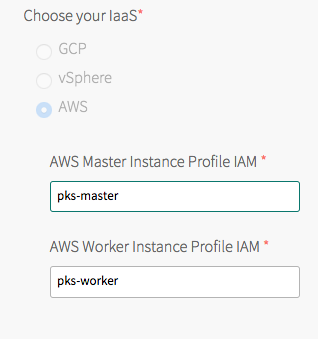
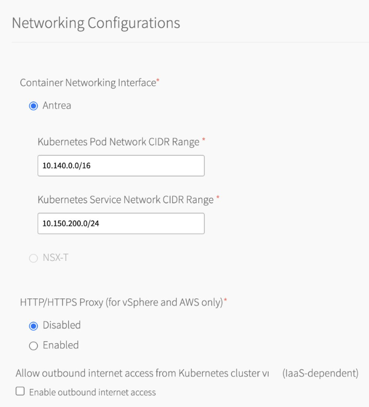

This topic describes how to install and configure {{  vars.product_full }}
on Amazon Web Services (AWS) as a {{ vars.platform_name }} tile.

## Prerequisites

Before performing the procedures in this topic, you must have deployed and configured {{ vars.platform_name }}.
For more information, see [AWS Prerequisites and Resource Requirements](aws-requirements.html).

This topic assumes that you have prepared the AWS environment for this {{  vars.product_full }} deployment.
For more information, see [Installing and Configuring {{ vars.platform_name }} on AWS](aws-om-install-config.html).

{{> prerequisites }}

## Overview

To install and configure {{ vars.product_short }}:

1. [Install {{  vars.product }}](#install)
1. [Configure {{  vars.product }}](#configure)
1. [Apply Changes](#apply-changes)
1. [Retrieve the {{ vars.product_short }} API Endpoint](#retrieve-tkgi-api)
1. [Configure an AWS Load Balancer for the {{ vars.product_short }} API](#lb-tkgi-api)
1. [Install the {{ vars.product_short }} and Kubernetes CLIs](#clis)
1. [Configure Authentication for {{  vars.product }}](#auth)

##  Step 1: Install {{  vars.product }}

{{> install }}

##  Step 2: Configure {{  vars.product }}

To configure {{ vars.product_short }}:

1. Click the orange **{{  vars.product }}** tile to start the configuration process.

    
    
<strong>WARNING</strong>: When you configure the {{  vars.product }} tile,
    do not use spaces in any field entries. This includes spaces between characters as well as
    leading and trailing spaces. If you use a space in any field entry, the deployment of {{  vars.product }} fails.

1. [Assign AZs and Networks](#azs-networks)
1. [{{ vars.product_short }} API](#tkgi-api)
1. [Plans](#plans)
1. [Kubernetes Cloud Provider](#cloud-provider)
1. [Networking](#networking)
1. [UAA](#uaa)
1. [(Optional) Host Monitoring](#syslog)
1. [(Optional) In-Cluster Monitoring](#cluster-monitoring)
1. [Tanzu Mission Control](#tmc)
1. [VMware CEIP](#telemetry)
1. [Errands](#errands)
1. [Resource Config](#resource-config)

###  Assign AZs and Networks

{{> azs-networks }}

###  {{ vars.product_short }} API

{{> api }}

###  Plans

{{> plans }}

###  Kubernetes Cloud Provider

To configure your Kubernetes cloud provider settings, follow the procedures below:

1. Click **Kubernetes Cloud Provider**.

1. Under **Choose your IaaS**, select **AWS**.

    

1. Enter your **AWS Master Instance Profile IAM**. This is the instance profile name associated with the control plane node.

1. Enter your **AWS Worker Instance Profile IAM**. This is the instance profile name associated with the worker node.
Your {{ vars.product_short }} worker nodes use the **AWS Worker Instance Profile IAM** to access the AWS API.

1. Click **Save**.

1. (Optional) Before using the Antrea Egress feature with worker nodes on AWS,
you must grant the worker instance profile additional AWS Identity and Access Management (IAM) permissions.
For more information, see
[Prepare AWS Worker Instance Profile Permissions](troubleshoot-issues.html#antrea-egress-aws)
in _General Troubleshooting_.

###  Networking

To configure networking, do the following:

1. Click **Networking**.
1. Under **Container Networking Interface**, select **Antrea**.
    
    Antrea is the Container Networking Interface (CNI) for {{ vars.product_short }} {{{ vars.product_version }}}. Flannel CNI is no longer supported.
    For more information about Flannel CNI removal, see
    <a href="https://techdocs.broadcom.com/us/en/vmware-tanzu/standalone-components/tanzu-kubernetes-grid-integrated-edition/1-18/tkgi/understanding-upgrades.html#upgrade-the-cni">About Switching from the Flannel CNI to the Antrea CNI</a> in the {{ vars.product_short }} 1.18 documentation.
1. (Optional) Enter values for **Kubernetes Pod Network CIDR Range** and **Kubernetes Service Network CIDR Range**.
    * Ensure that the CIDR ranges do not overlap and have sufficient space for your deployed services.
    * Ensure that the CIDR range for the **Kubernetes Pod Network CIDR Range** is large enough to accommodate the expected maximum number of pods.
 
1. (Optional) Configure a global proxy for all outgoing HTTP and HTTPS traffic from your Kubernetes clusters and
the {{ vars.product_short }} API server. See [Using Proxies with {{  vars.product }} on AWS](proxies-aws.html) for instructions to enable a proxy.
1. (Optional) If you do not use a NAT instance, select **Allow outbound internet access from Kubernetes cluster vms (IaaS-dependent)**. Enabling this functionality assigns external IP addresses to VMs in clusters.

1. Click **Save**.

###  UAA

{{> uaa }}

###  (Optional) Host Monitoring

{{> host-monitoring }}

###  (Optional) In-Cluster Monitoring

{{> cluster-monitoring }}

###  Tanzu Mission Control

{{> tmc }}

###  VMware CEIP
{{> usage-data }}

###  Errands
{{> errands }}

###  Resource Config

To modify the resource configuration of {{  vars.product }} and specify your {{ vars.product_short }} API load balancer, follow the steps below:

1. Select **Resource Config**.

1. {{> resource-config }}

1. For the **{{ vars.product_short }} Database** job:
    * Leave the **LOAD BALANCERS** field blank.
    * (Optional) If you do not use a NAT instance, select **INTERNET CONNECTED**. This allows component instances direct access to the internet.

1. For the **{{ vars.product_short }} API** job:
    * Enter the name of your {{ vars.product_short }} API load balancer in the **LOAD BALANCERS** field. For more information, see [Define Load Balancer](aws-api-load-balancer.html#define-lb) in _Configuring an AWS Load Balancer for the {{ vars.product_short }} API_.
    {{> lb-resource-config }}

    * (Optional) If you do not use a NAT instance, select **INTERNET CONNECTED**. This allows component instances direct access to the internet.

  
<strong>Warning:</strong> To avoid workload downtime, use the resource configuration recommended in
  <a href="understanding-upgrades.html">About {{  vars.product }} Upgrades</a>
  and <a href="maintain-uptime.html">Maintaining Workload Uptime</a>.
  

##  Step 3: Apply Changes

{{> apply-changes }}

##  Step 4: Retrieve the {{ vars.product_short }} API Endpoint

{{> share-endpoint }}

 
 

##  Step 5: Configure an AWS Load Balancer for the {{ vars.product_short }} API

Follow the procedures in [Configuring an AWS Load Balancer for the {{ vars.product_short }} API](aws-api-load-balancer.html) to configure an AWS load balancer for the {{ vars.product_short }} API.

 
 

##  Step 6: Install the {{ vars.product_short }} and Kubernetes CLIs

{{> install-cli }}

##  Step 7: Configure Authentication for {{  vars.product }}

Follow the procedures in [Setting Up {{  vars.product }} Admin Users on AWS](aws-configure-users.html).

##  Next Steps

After installing {{  vars.product }} on AWS, you might want to do one or more of the following:

* Create a load balancer for your {{  vars.product }} clusters. For more information, see [Creating and Configuring an AWS Load Balancer for {{  vars.product }} Clusters](aws-cluster-load-balancer.html).
* Create your first {{  vars.product }} cluster. For more information, see [Creating Clusters](create-cluster.html).
