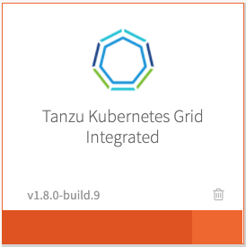
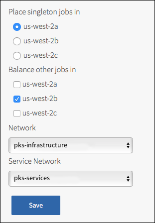

This topic describes how to install and configure {{  vars.product_full }}
on vSphere with Antrea networking as a {{ vars.platform_name }} tile.

##Prerequisites

Before performing the procedures in this topic, you must have deployed and configured {{ vars.platform_name }}.
For more information, see [vSphere Prerequisites and Resource Requirements](vsphere-requirements.html).

{{> prerequisites }}

## Overview

To install and configure {{ vars.product_short }}:

1. [Install {{  vars.product }}](#install)
1. [Configure {{  vars.product }}](#configure)
1. [Apply Changes](#apply-changes)

## Step 1: Install {{  vars.product }}

{{> install }}

## Step 2: Configure {{  vars.product }}

To configure {{ vars.product_short }}:

1. Click the orange **{{  vars.product }}** tile to start the configuration process.

    

    
<strong>WARNING</strong>: When you configure the {{  vars.product }} tile, do not use spaces in any field entries. This includes spaces between characters as well as
    leading and trailing spaces. If you use a space in any field entry, the deployment of {{  vars.product }} fails.

1. [Assign AZs and Networks](#azs-networks)
1. [{{ vars.product_short }} API](#tkgi-api)
1. [Plans](#plans)
1. [Kubernetes Cloud Provider](#cloud-provider)
1. [Networking](#networking)
1. [UAA](#uaa)
1. [(Optional) Host Monitoring](#syslog)
1. [(Optional) In-Cluster Monitoring](#cluster-monitoring)
1. [Tanzu Mission Control](#tmc)
1. [VMware CEIP](#telemetry)
1. [Storage](#storage-config)
1. [Errands](#errands)
1. [Resource Config](#resource-config)

###  Assign AZs and Networks

To configure the availability zones (AZs) and networks
used by the {{{ vars.product_short }}} control plane:

1. Click **Assign AZs and Networks**.

1. Under **Place singleton jobs in**, select the AZ where you want to deploy the
{{{ vars.control_plane }}} and {{{ vars.control_plane_db }}}.

    
1. Under **Balance other jobs in**, select the AZ for balancing other {{{ vars.product_short }}} control plane jobs.
    
<strong>Note</strong>: You must specify the <strong>Balance other jobs in</strong> AZ, but the selection has no effect in the current version of {{{ vars.product_short }}}.
    

1. Under **Network**, select the infrastructure subnet that you created for {{{ vars.product_short }}} component VMs, such as the {{{ vars.control_plane }}} and {{{ vars.control_plane_db }}} VMs.
1. Under **Service Network**, select the services subnet that you created for Kubernetes cluster VMs.
1. Click **Save**.

###  {{ vars.product_short }} API

{{> api }}

###  Plans

{{> plans }}

###  Kubernetes Cloud Provider

{{> cloud-provider }}

###  Networking

{{> networking-vsphere }}

###  UAA

{{> uaa }}

###  (Optional) Host Monitoring

{{> host-monitoring }}

###  (Optional) In-Cluster Monitoring

{{> cluster-monitoring }}

###  Tanzu Mission Control

{{> tmc }}

###  VMware CEIP

{{> usage-data }}

###  Storage

{{> storage-config }}

###  Errands

{{> errands }}

###  Resource Config

To modify the resource configuration of {{  vars.product }}, follow the steps below:

1. Select **Resource Config**.
1. {{> resource-config }}

1. Under each job, leave **NSX CONFIGURATION** and **NSX-V CONFIGURATION** blank.

  
<strong>Warning:</strong> To avoid workload downtime, use the resource configuration recommended in
  <a href="understanding-upgrades.html">About {{  vars.product }} Upgrades</a>
  and <a href="maintain-uptime.html">Maintaining Workload Uptime</a>.
  

##  Step 3: Apply Changes

{{> apply-changes }}

##  Next Installation Step

To configure the {{ vars.product_short }} API load balancer, follow the instructions in [Configure {{ vars.product_short }} API Load Balancer](vsphere-configure-api.html).
