This topic describes how to deploy an NSX load balancer for the {{  vars.product_full }} API Server.

##<a id='about'></a> About the NSX Load Balancer for the {{ vars.product_short }} API Server

If you deploy {{  vars.product }} on vSphere with NSX with the {{ vars.product_short }} API in high-availability mode, you must configure an NSX load balancer for the {{ vars.product_short }} API traffic. For more information, see [Load Balancers in {{  vars.product }} Deployments on vSphere with NSX‑T](./about-lb.html#with-nsx-t).

To provision an NSX load balancer for the {{ vars.product_short }} API Server VM, complete the following steps.

##<a id='create-nsgroup'></a> Step 1: Create NSGroup

If you are using a Dynamic Server Pool, create an NSGroup as described in this step. If you are using a Static Server Pool, skip this step and proceed to Step 2.

1. Log in to an NSX Manager Node.
    <p class="note"><strong>Note</strong>: You can connect to any NSX Manager Node in the management cluster to provision the load balancer.</p>
1. Select the **Advanced Networking & Security** tab.
    <p class="note"><strong>Note</strong>: You must use the <strong>Advanced Networking and Security</strong> tab in NSX Manager to create, read, update, and delete all NSX networking objects used for {{  vars.product }}.</p>
1. Select **Inventory > Groups**.
    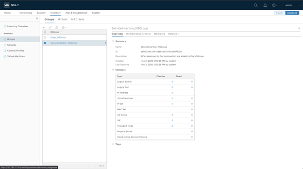
1. Click **+ADD** to add an new NSGroup.
1. Enter a name for the NSGroup, for example `tkgi-api`.
    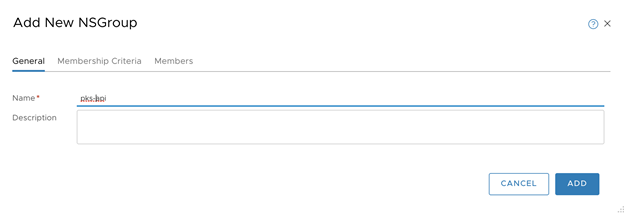
1. Click **ADD**.


##<a id='create-virtual-servers'></a> Step 2: Create Two Virtual Servers

The {{ vars.product_short }} API Sever virtual machine hosts two server processes and exposes two ports: the {{ vars.product_short }} API Server on port 9021, and the UAA server on port 8443. Each NSX Virtual Server listens on one port. Thus, you need two Virtual Servers, one for the {{ vars.product_short }} API server and the other for UAA.

If you deploy your {{  vars.product }} using [No-NAT with Virtual Switch (VSS/VDS) Topology](nsxt-topologies.html#alias), You only need to deploy ONE virtual Server

###<a id='create-vs-api'></a> Create a Virtual Server for the {{ vars.product_short }} API Server

1. In NSX Manager, select **Networking > Load Balancing > Virtual Servers**.
1. Click Add.
1. Configure General Properties for the Virtual Server.
  - Name: `tkgi-api-server`, for example
  - Application Types: Choose **Layer 7 TCP**. Or, you can choose Layer 4, in which case you don't have to configure SSL for the virtual server.
  For [No-NAT with Virtual Switch (VSS/VDS) Topology](nsxt-topologies.html#alias), Choose Layer 4
  - Application Profile: `default-http-lb-app-profile`
  - Access Log: `Disabled`
  - Click **Next**
1. Configure Virtual Server Identifiers.
  - IP Address: Enter an IP address from the floating pool, such as `192/168.160.108`
  - Port: **9021** (for the {{ vars.product_short }} API Server). For [No-NAT with Virtual Switch (VSS/VDS) Topology](nsxt-topologies.html#alias), Set Port: **9021,8443***
  - Click **Next**
1. Configure Server Pool and Rules.
  - Click **Create a New Server Pool**
  - Name the server pool, for example **tkgi-api-server**
  - Load Balancing Algorithm: **ROUND_ROBIN** (for example)
  - Click **Next**
1. Configure SNAT Translation for the Server Pool:
  - Translation Mode: Auto Map. For [No-NAT with Virtual Switch (VSS/VDS) Topology](nsxt-topologies.html#alias), Translation Mode: **IP List**. IP Address: Same IP address entered inside Virtual Server Identifiers.
  - Click **Next**
1. OPTION 1: Configure Pool Members for the Static Server Pool:
  - Membership Type: **Static**
  - Leave members empty. This will be added automatically later when you apply changes in {{ vars.platform_name }}.
  - Click **Next**
1. OPTION 2: Configure Pool Members for the Dynamic Server Pool:
  - Membership Type: **Dynamic**
  - Set NSGroup as the NSGroup name created in Step 1, such as **tkgi-api**
  - Set Max Group IP Address List to 3, since we can only have up to 3 {{ vars.product_short }} API instances
  - Click **Next**
  For [No-NAT with Virtual Switch (VSS/VDS) Topology](nsxt-topologies.html#alias),
  - Membership Type: **Static**
  - Static Membership: Add your {{  vars.product }} API Server one by one, leave port column empty
  - Click **Next**
1. Configure Health Monitors for the virtual server:
  - Click **Create A New Active Monitor**
  - Set **Name**, for example **tkgi-api-server**
  - Set Health Check Protocol **LBHttpsMonitor**
  - Set the port as **9021**
  - Leave other fields as default
  - Click **Next**
1. Configure Health Check Parameters:
  - Choose **High Security for SSL Ciphers**
  - Select **TLS_V1_2** as SSL Protocols
  - Set HTTP Method as **GET**
  - Set HTTP Request URL as **/actuator/health**
  - Set HTTP Request Header as **200**
  - Click **Finish**
1. Configure **New Server Pool > Health Monitors**:
  - Set Active Health Monitor as the what was created: **tkgi-api-server**
  - Click **Finish**
1. Configure the Virtual Server:
  - Set the Default Server Pool to what you just created: **tkgi-api-server**
  - Click **Next**
1. Persistence Profiles is optional. Click **Next**.
1. Configure Client Side SSL (only if L7 Application Type is selected). Use the default certificates. Click **Next**.
1. Configure Server Side SSL (only if L7 Application Type is selected). Use the default certificates. Click **Finish**.

  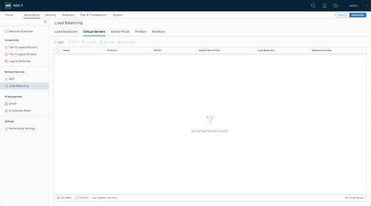
  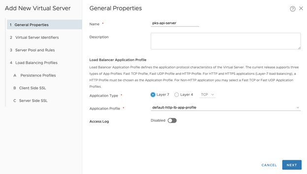
  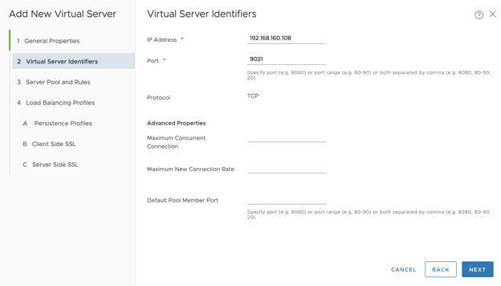
  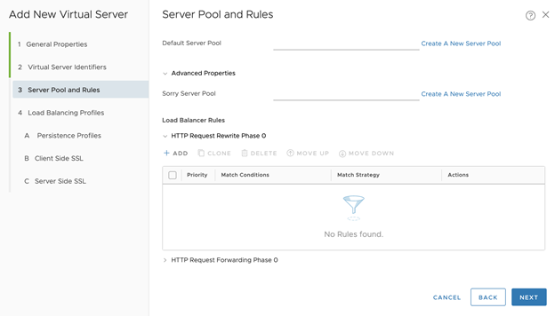
  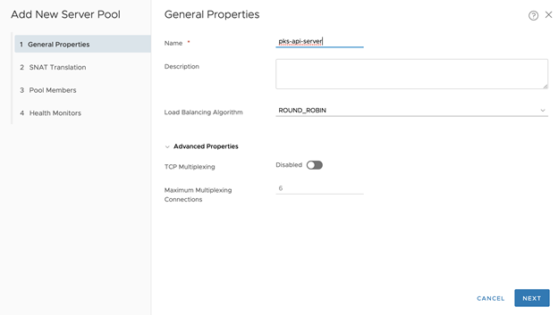
  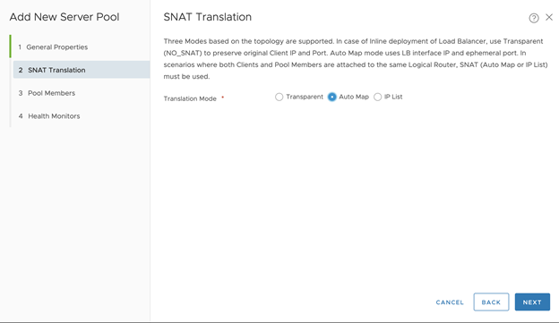
  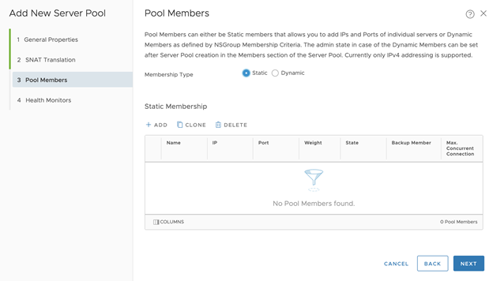
  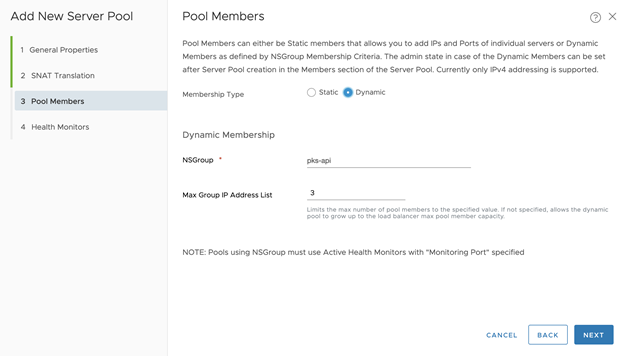
  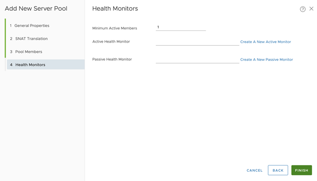
  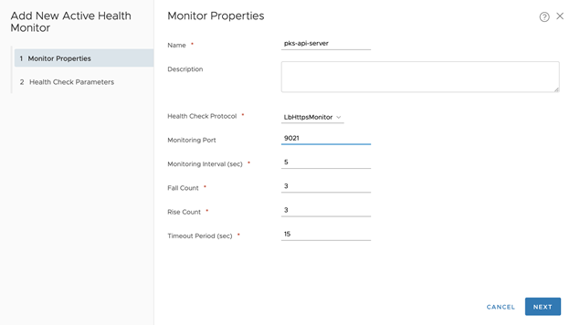
  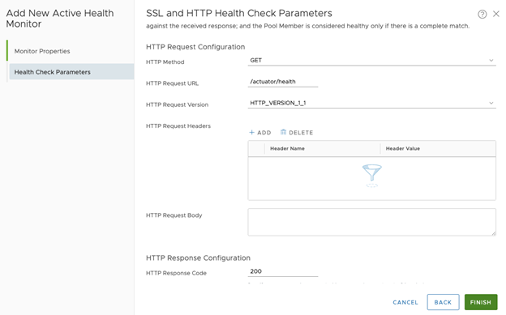
  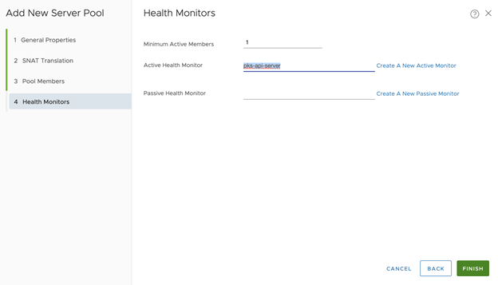
  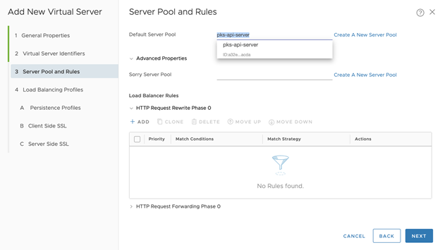
  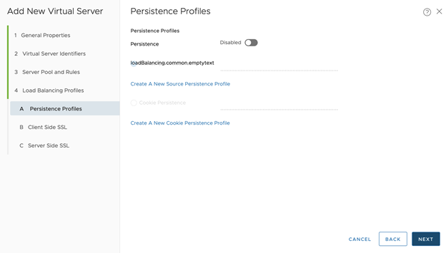
  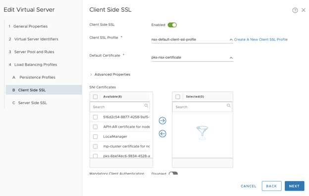
  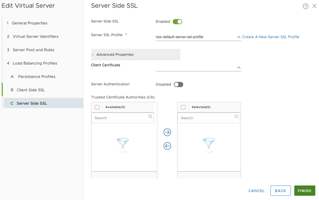

###<a id='create-vs-uaa'></a> Create a Virtual Server for the UAA Server

Skip this if you deploy as [No-NAT with Virtual Switch (VSS/VDS) Topology](nsxt-topologies.html#alias)

1. Select the `tkgi-api-server` Virtual Server you created and and click **Clone**.
1. Click **Edit** to change the content and configure the virtual server for UAA.
1. Configure General Properties
  - Set the Name as **tkgi-api-uaa**
  - Click **Next**
1. Configure Virtual Server Identifiers
  - Set the Port to **8443**
  - Click **Next**
1. Configure Server Pool and Rules
  - Click Create A New Server Pool
  - Set name to **tkgi-api-uaa**
  - Click **Next**
1. Configure SNAT Translation for the Server Pool
  - Configure Pool Members to be the same as you configured for the `tkgi-api-server` Virtual Server
  - Click **Next**
1. Configure Health Monitors:
  - Click Create A New Active Monitor
  - Set Name, for example **tkgi-api-uaa**
  - Set Health Check Protocol **LBHttpsMonitor**
  - Set port as **8443**
  - Leave other fields as default
  - Click **Next**
1. Configure Health Check Parameters:
  - Choose High Security for SSL Ciphers
  - Select TLS_V1_2 as SSL Protocols
  - Set HTTP Request URL as /healthz
  - Set HTTP Request Header as 200
  - Click **Finish**
1. Configure a New Server Pool
  - Set Active Health Monitor to tkgi-api-uaa
  - Click **Finish**
1. Edit Virtual Server
  - Set Default Server Pool as tkgi-api-uaa
  - Click **Next**
1. Persistence Profiles is optional. Click **Next**.
1. Configure Client Side SSL (only if L7 Application Type is selected). Use the default certificates. Click **Next**.
1. Configure Server Side SSL (only if L7 Application Type is selected). Use the default certificates. Click **Finish**.

  
  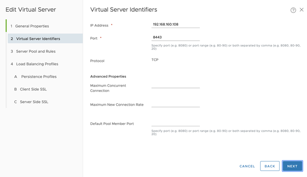
  
  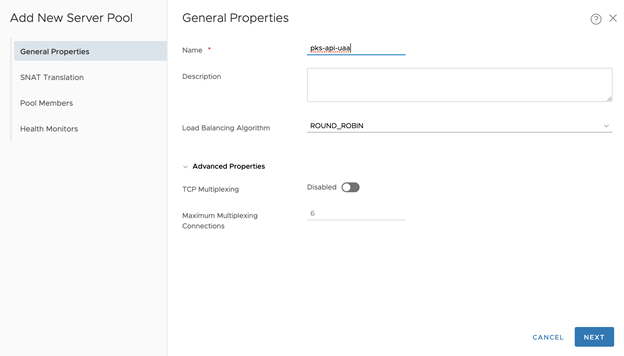
  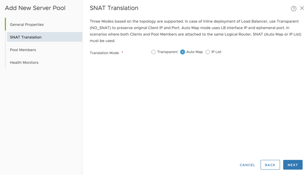
  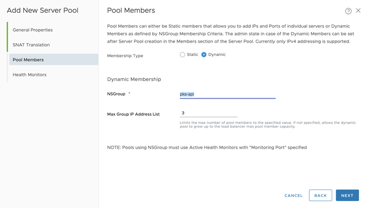
  
  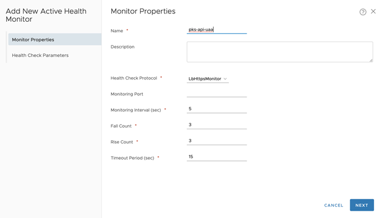
  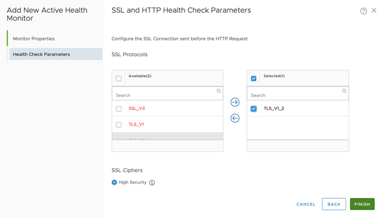
  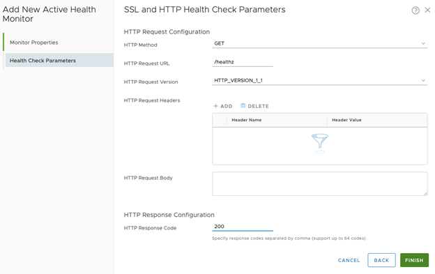
  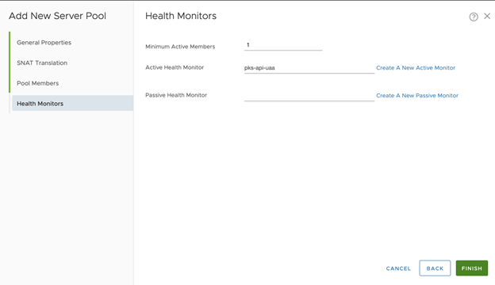
  

##<a id='create-lb'></a> Step 3: Create Load Balancer

1. In NSX Manager, select Networking > Load Balancing > Load Balancers.
    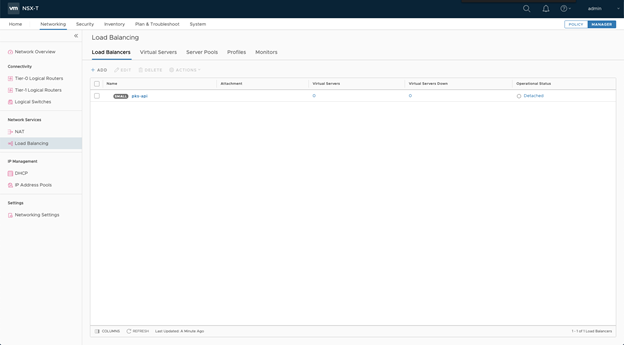
1. Click **Add**.
1. Set the **Name**. For example `tkgi-api`.
1. Choose the Load Balancer Size. The default SMALL is sufficient for most {{ vars.product_short }} deployments.
For large-scale deployments, use are larger size load balancer.
    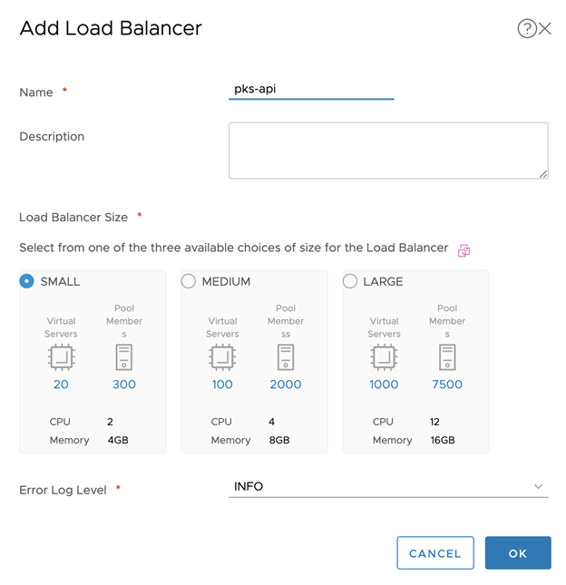
1. Click **OK**.


##<a id='attach-lb-router'></a> Step 4: Attach the Load Balancer to a Logical Router

1. In NSX Manager, select Networking > Load Balancing > Load Balancers.
    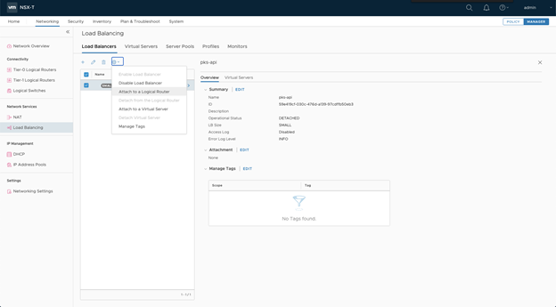
1. Choose the `tkgs-api` load balancer you just created.
1. Click the gear icon and select **Attach to a Logical Router**.
1. Choose a Tier-1 logical router that is attached to {{ vars.product_short }} API VMs.
    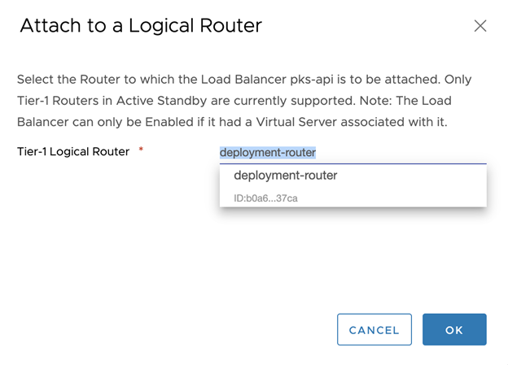
1. Click **OK**.


### Troubleshooting LB-Router Attachment

If your logical router does not have an associated edge cluster, you will see an error similar to the following:

    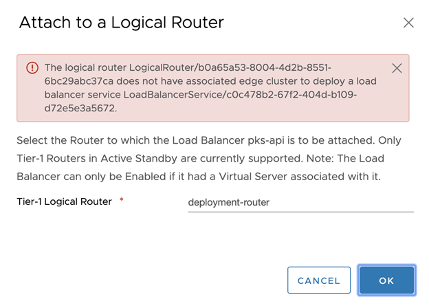

When this occurs, you must create a Logical Router that is associated with the Edge Cluster.

To create and configure a new Tier-1 router:

1. Select **Networking > Tier-1 Logical Routers**.
    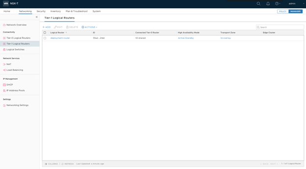
1. Click **Add**.
1. Configure Tier-1 Router:
    - Set the **Name**. For example; `tkgi-api`.
    - Set **Tier-0 Router**.
    - Set **Edge Cluster**.
    - Set **Edge Cluster member**.
    - Click **Add**.
    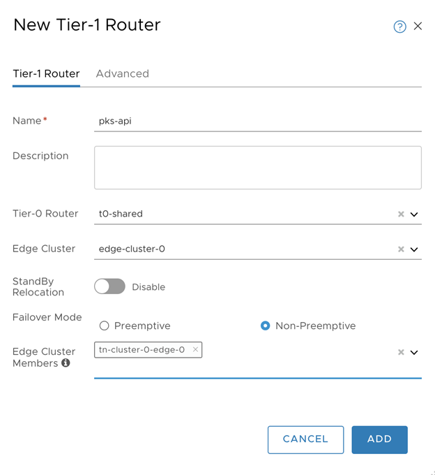
1. Configure **Route Advertisement** for the Tier-1 Router.
    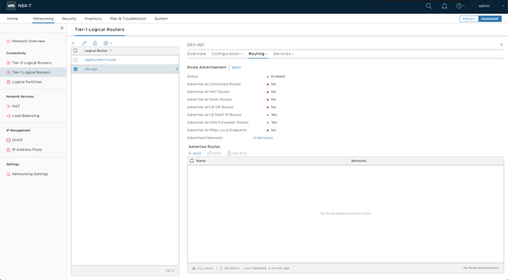
    - Select the Tier-1 Router.
    - Select the **Routing** tab.
    - Select **Route Advertisement** > **Edit**.
    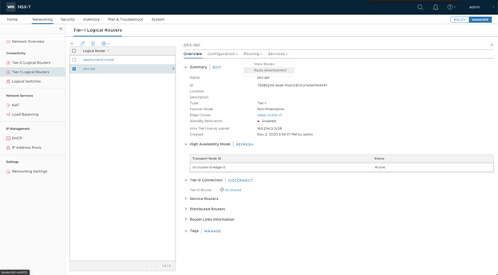
    - Enable Route Advertisement for all load balancer VIP routes for the Tier-1 Router:
  	    - **Status**: `Enabled`.
        - **Advertise all LB VIP routes**: `Yes`.
        - **Advertise all LB SNAT IP routes**: `Yes`.
        - Click **Save**.
        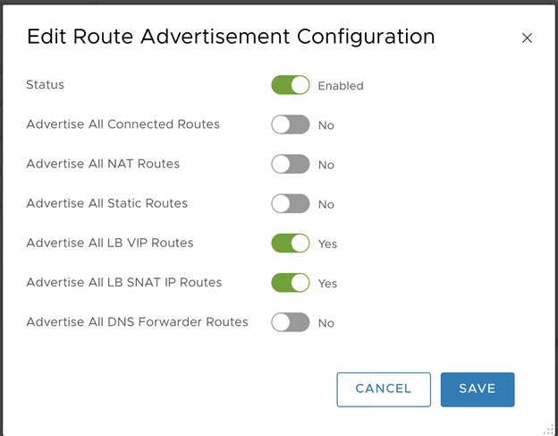
1. Attach the Logical Router to Load Balancer.

1. Click **OK** to complete the operation.
  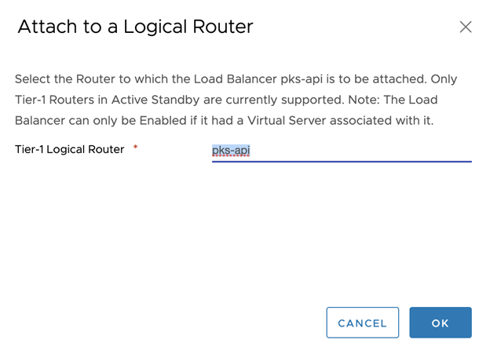

##<a id='attach-lb-vs'></a> Step 5: Attach the Load Balancer to the Virtual Servers

1. Select the Load Balancer.
    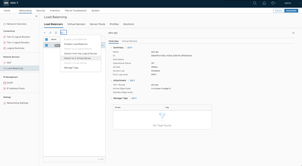
1. Click the **Settings** icon.
1. Select **Attach to a Virtual Server**.
    
1. Attach the load balancer to the `tkgi-api-server` virtual server. Confirm it is included inside the **Virtual Servers** tab.
1. Click **Ok**.
1. Click **Settings**.
1. Select **Attach to a Virtual Server**.
    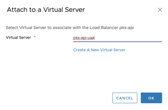
1. Attach to the `tkgi-api-uaa` virtual server.  Confirm it is included inside the **Virtual Servers** tab.
1. Click **Ok**.
  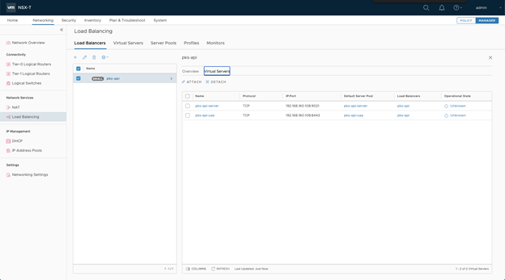

##<a id='config-tile'></a> Step 6: Configure {{ vars.product_short }} to Use the Load Balancer

Skip this if you deployed as [No-NAT with Virtual Switch (VSS/VDS) Topology](nsxt-topologies.html#alias)

Now that the load balancer for the {{ vars.product_short }} API control plane is configured, update the {{ vars.product_short }} tile to point to the load balancer.

1. Log in to {{ vars.platform_name }}.
1. Go to **{{  vars.product }} Tile Resource Config**.
1. Click **{{ vars.product_short }} API**. You will see a drop down for **{{ vars.product_short }} API config**.
1. Change the **{{ vars.product_short }} API Instances Number** to `2` or `3`. We recommend `3` for quorum.
1. Set the **NSGroup** if you configured **Dynamic Server Pool**. Otherwise leave it empty.
1. Set **VIF Type** to `PARENT` or leave it empty.
1. Set the **Logical Load Balancer** as follows:

    ```
    {
      "server_pools": [
        {
          "name": "tkgi-api-server",
          "port": 9021
        },
        {
          "name": "tkgi-api-uaa",
          "port": 8443
        }
      ]
    }
    ```
1. Click **Save**.
1. Click **apply-changes** and wait for {{ vars.platform_name }} to finish saving the settings.
  - For static server pools, this operation will add the VM as server pool member.
  - For dynamic server pools, this operation will add the VM to the corresponding NSGroup.

    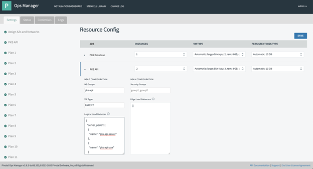

##<a id='test-lb'></a> Step 7: Test the Load Balancer

To validate your Load Balancer configuration:

1. In **NSX Manager**, verify that the operational status of the load balancer is up.
    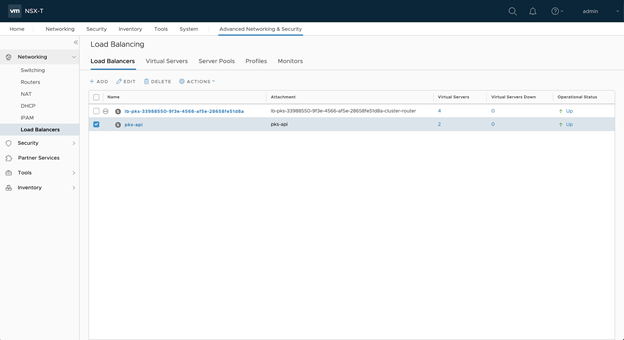
1. Make sure the Virtual Servers are up.
    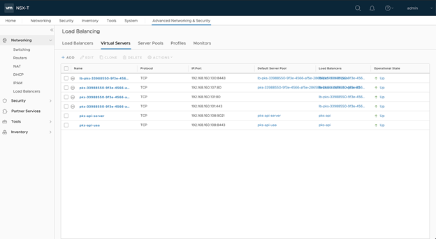
1. Make sure the Server Pools are up.
    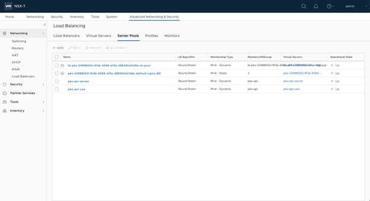
1. To test the load balancer:

    1. Using your {{ vars.product_short }} client jump host, change the {{ vars.product_short }} API hostname to resolve to the Load Balancer IP.
<br>
        For example, you can use `192.168.160.108` as the IP address of the load balancer:

        ```
        kubo@jumper:~$ cat /etc/hosts
        127.0.0.1	localhost
        127.0.1.1	jumper.localdomain	jumper

        # The following lines are desirable for IPv6 capable hosts
        ::1     localhost ip6-localhost ip6-loopback
        ff02::1 ip6-allnodes
        ff02::2 ip6-allrouters
        192.168.111.93   vxlan-vm-111-93.vmware.com
        192.168.111.109  nsxmanager.tkgi.vmware.local
        192.168.160.108  tkgi.tkgi-api.cf-app.com
        ```

    1. Log in to the {{ vars.product_short }} API Server via the load balancer.
<br>
        For example:

        ```
        kubo@jumper:~$ tkgi login -a tkgi.tkgi-api.cf-app.com -u lana -p password -k && tkgi clusters

        API Endpoint: tkgi.tkgi-api.cf-app.com
        User: lana
        Login successful.

        TKGI Version    Name        k8s Version  Plan Name  UUID                                  Status     Action
        1.23.0-build.33  test_one  	1.31.9       Plan 1     33988550-...-28658fe51d8a  succeeded  UPDATE
        ```
