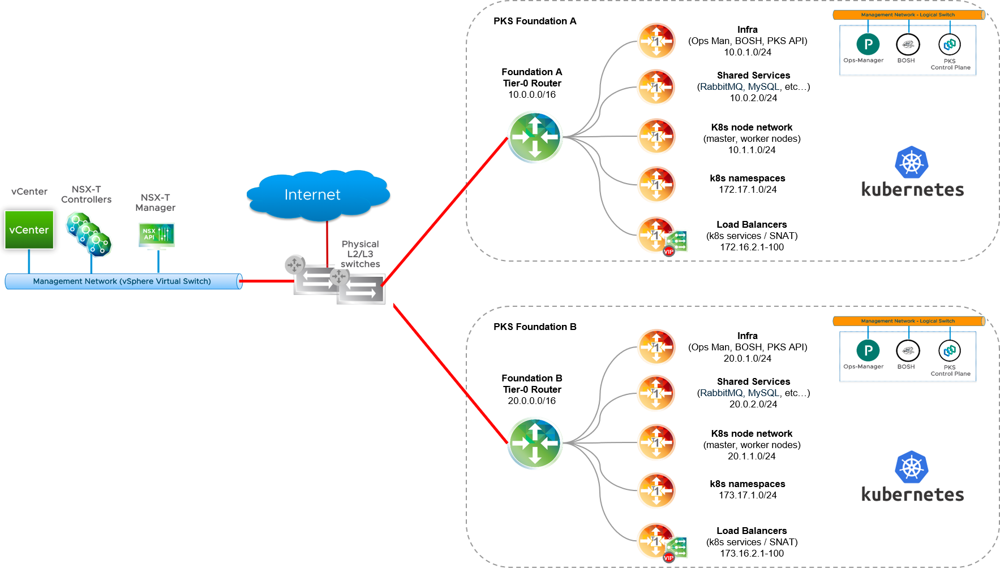
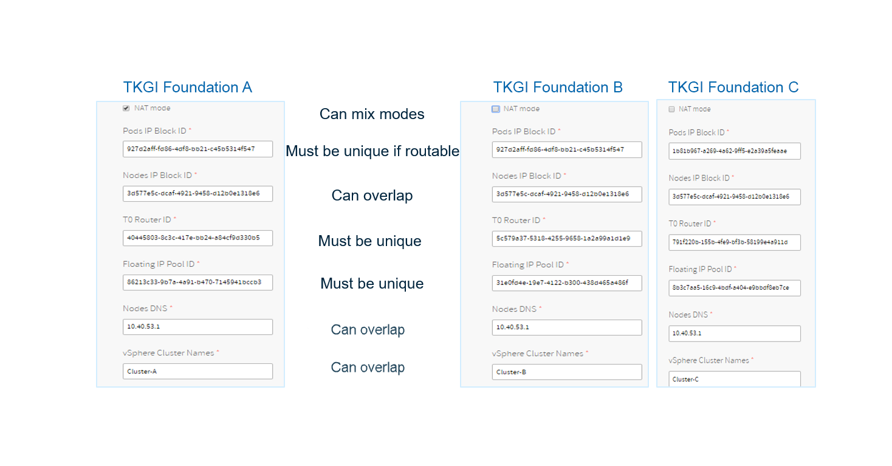

This topic describes how to deploy multiple instances of {{  vars.product_full }} ({{ vars.product_short }}) on vSphere with NSX infrastructure.

##  About Multi-Foundation {{  vars.product }}

A multi-foundation deployment of {{  vars.product }} lets you install and run multiple instances of {{  vars.product }}. The purpose of a multi-foundation deployment of {{  vars.product }} is to share a common vSphere and NSX infrastructure across multiple foundations, while providing complete networking isolation across foundations.

As shown in the diagram, with a multi-foundation {{  vars.product }} topology, each TKGI instance is deployed to a dedicated NSX Tier-0 router. Foundation A T0 router with Management CIDR 10.0.0.0/16 connects to the vSphere and NSX infrastructure. Similarly, Foundation B T0 router with Management CIDR  20.0.0.0/16 connects to the same vSphere and NSX components.

As with a single instance deployment, TKGI management components are deployed to a dedicated network, for example, 10.0.0.0/24 for TKGI Foundation A; 20.0.0.0/24 for TKGI Foundation B. When {{  vars.product }} is deployed, networks are defined for nodes, pods, and load balancers. Because of the dedicated Tier-0 router, there is complete networking isolation between each {{  vars.product }} instance.

##  Requirements

To implement a multi-foundation {{  vars.product }} topology, adhere to the following requirements:

- One Tier-0 router for each {{  vars.product }} instance. For more information, see <a href="./nsxt-multi-t0.html">Isolating Tenants</a>.
- The Floating IP pool must not overlap. The CIDR range for each Floating IP Pool must be unique and not overlapping across foundations. For more information, see <a href="./nsxt-create-objects.html">Create Floating IP Pool</a>.
- {{  vars.product }} instances can be deployed in NAT and no-NAT mode. If more than one {{  vars.product }} instance is deployed in no-NAT mode, the Nodes IP Block networks cannot overlap.
- For any Pods IP Block used to deploy Kubernetes clusters in no-NAT (routable) mode, the Pods IP Block cannot overlap across foundations.
- The [NSX Super User Principal Identity Certificate](./nsxt-generate-pi-cert.html) is unique per TKGI instance.

The image below shows three {{  vars.product }} installations across three Tier-0 foundations. Key considerations to keep in mind with a multi-foundation {{  vars.product }} topology include the following:

- Each foundation must rely on a dedicated Tier-0 router
- You can mix-and-match NAT and no-NAT mode across foundations for Node and Pod networks
- If you are using non-routable Pods IP Block networks, the Pods IP Block addresses can overlap across foundations
- Because Kubernetes nodes are behind a dedicated Tier-0 router, if clusters are deployed in NAT mode the Nodes IP Block addresses can also overlap across foundations
- For each foundation you must define a unique Floating ID Pool with non-overlapping IPs

