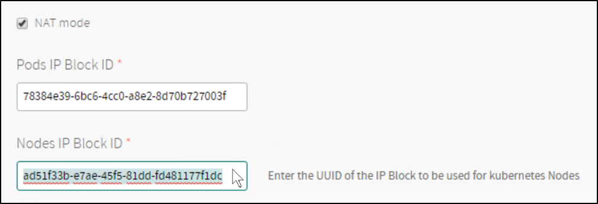
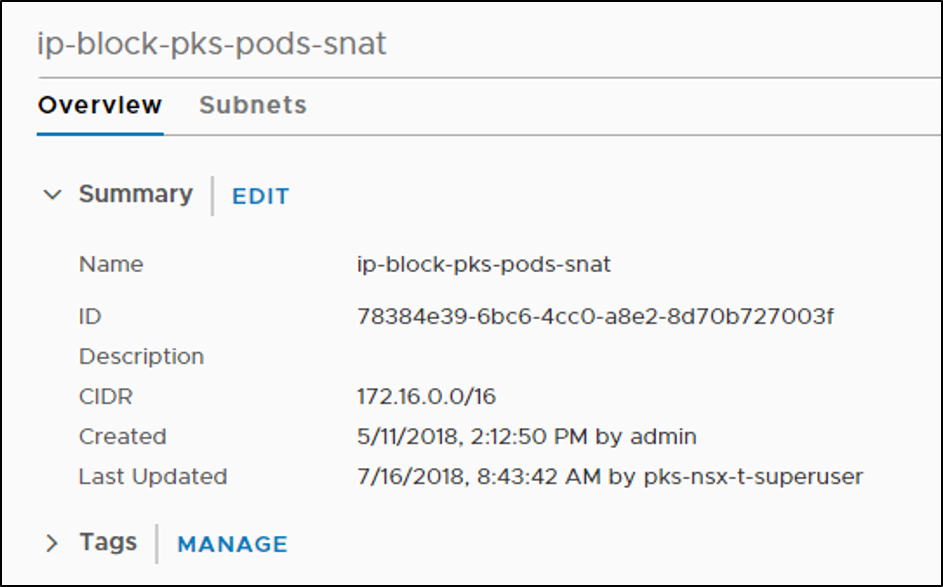
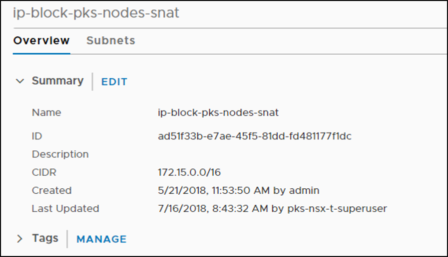

This topic describes how to plan your environment before installing {{ vars.product_full }} ({{ vars.product_short }}) on VMware vSphere with NSX integration.

## Overview

Before installing {{ vars.product_full }} on VMware vSphere with NSX integration, plan your environment as described in the following sections:

* [Prerequisites](#prerequisites)
* [Understand Component Interactions](#components)
* [Plan Deployment Topology](#plan-topology)
* [Plan Network CIDRs](#plan-cidrs)
* [Gather Other Required IP Addresses](#plan-ip-blocks)

## Prerequisites

Familiarize yourself with the following VMware documentation:

* [vSphere, vCenter, vSAN, and ESXi documentation](https://techdocs.broadcom.com/us/en/vmware-cis/vsphere.html)
* [VMware NSX Documentation](https://techdocs.broadcom.com/us/en/vmware-cis/nsx.html)
* [NSX Container Plugin (NCP) documentation](https://techdocs.broadcom.com/us/en/vmware-cis/nsx/event-catalog/4-2/nsx-container-plugin-for-kubernetes-and-tanzu-application-service.html)

Familiarize yourself with the following related documentation:

* [{{ vars.platform_name }} documentation](https://techdocs.broadcom.com/us/en/vmware-tanzu/platform/tanzu-operations-manager/3-1/tanzu-ops-manager/vsphere-deploy.html)
* [BOSH documentation](https://bosh.io/docs/bosh-components/)
* [Kubernetes documentation](https://kubernetes.io/docs/home/)
* [containerd documentation](https://containerd.io/docs/)

Review the following {{ vars.product }} documentation:

* [VMware vSphere with NSX Version Requirements](vsphere-nsxt-requirements.html)
* [Hardware Requirements for {{ vars.product }} on VMware vSphere with NSX](vsphere-nsxt-rpd-mpd.html)
* [VMware Ports and Protocols](https://ports.vmware.com/home/vSphere-Data-Center-for-vSphere-Data-Center)
on the VMware site.
* [Network Objects Created by NSX for {{ vars.product }}](./vsphere-nsxt-cluster-objects.html)

## Understand Component Interactions

{{ vars.product }} on VMware vSphere with NSX requires the following component interactions:

* vCenter, NSX Manager Nodes, NSX Edge Nodes, and ESXi hosts must be able to communicate with each other.
* The BOSH Director VM must be able to communicate with vCenter and the NSX Management Cluster.
* The BOSH Director VM must be able to communicate with all nodes in all Kubernetes clusters.
* Each {{ vars.product }}-provisioned Kubernetes cluster deploys the NSX Node Agent and the Kube Proxy that run as BOSH-managed processes on each worker node.
* NCP runs as a BOSH-managed process on the Kubernetes control plane node. In a multi-control plane node deployment, the NCP process runs on all control plane nodes, but is active only on one control plane node. If the NCP process on an active control plane node is unresponsive, BOSH activates another NCP process.

## Plan Deployment Topology

Review the [Deployment Topologies](nsxt-topologies.html) for {{ vars.product }} on VMware vSphere with NSX. The most common deployment topology is the [NAT topology](./nsxt-topologies.html#topology-nat). Decide which deployment topology you will implement, and plan accordingly.

## Plan Network CIDRs

Before you install {{ vars.product }} on VMware vSphere with NSX, plan the CIDRs and IP blocks that you are using in your deployment.

Plan for the following network CIDRs in the IPv4 address space according to the instructions in [VMware NSX documentation](https://techdocs.broadcom.com/us/en/vmware-cis/nsx.html):

* **VTEP CIDRs**: One or more of these networks host your GENEVE Tunnel Endpoints on your NSX Transport Nodes. Size the networks to support all of your expected Host and Edge Transport Nodes. For example, a CIDR of `192.168.1.0/24` provides 254 usable IPs.

* **TKGI MANAGEMENT CIDR**: This small network is used to access {{ vars.product }} management components such as {{ vars.platform_name }}, BOSH Director, and {{ vars.product }} VMs as well as the Harbor Registry VM if deployed. For example, a CIDR of `10.172.1.0/28` provides 14 usable IPs. For the [No-NAT deployment topologies](nsxt-topologies.html#topology-no-nat-virtual-switch), this is a corporate routable subnet /28. For the [NAT deployment topology](nsxt-topologies.html#topology-nat), this is a non-routable subnet /28, and DNAT needs to be configured in NSX to access the {{ vars.product }} management components.

* **TKGI LB CIDR**: This network provides your load balancing address space for each Kubernetes cluster created by {{ vars.product }}. The network also provides IP addresses for Kubernetes API access and Kubernetes exposed services. For example, `10.172.2.0/24` provides 256 usable IPs. This network is used when creating the `ip-pool-vips` described in [Creating VMware NSX Objects for {{ vars.product }}](nsxt-create-objects.html), or when the services are deployed. You enter this network in the
**Floating IP Pool ID** field in the **Networking** pane of the {{ vars.product }} tile.

## Plan IP Blocks

When you install {{ vars.product }} on VMware NSX, you are required to specify the **Pods IP Block ID** and **Nodes IP Block ID** in the **Networking** pane of the {{ vars.product }} tile.

**Pods IP Block ID** and **Nodes IP Block ID** IDs map to the two IP blocks you must configure in VMware NSX: the Pods IP Block for Kubernetes pods, and the Node IP Block for Kubernetes nodes (VMs).

To configure **Pods IP Block ID** and **Nodes IP Block ID**:

* [Plan IP Blocks](#plan-ip-blocks)
* [Pods IP Block](#pods-ip-block)
* [Nodes IP Block](#nodes-ip-block)
* [Reserved IP Blocks](#reserved-ip-blocks)

For more information, see the [Networking](installing-nsx-t.html#networking) section of *Installing {{ vars.product }} on VMware vSphere with NSX Integration*.

  

### Pods IP Block

Each time a Kubernetes namespace is created, a subnet from the **Pods IP Block** is allocated. The subnet size carved out from this block is /24, which means a maximum of 256 pods can be created per namespace.

When a Kubernetes cluster is deployed by {{ vars.product }}, by default 3 namespaces are created. Often additional namespaces will be created by operators to facilitate cluster use. As a result, when creating the **Pods IP Block**, you must use a CIDR range larger than /24 to ensure that NSX has enough IP addresses to allocate for all pods. The recommended size is /16. For more information, see [Creating VMware NSX Objects for {{ vars.product }}](nsxt-create-objects.html).

<strong>Note</strong>: By default, <strong>Pods IP Block</strong> is a block of non-routable, private IP addresses.
After you deploy {{ vars.product }}, you can define a network profile that specifies a routable IP block for your pods.
The routable IP block overrides the default non-routable <strong>Pods IP Block</strong> when a Kubernetes cluster is deployed using that network profile. For more information, see <a href="network-profiles.html#routable-pods">Routable Pods</a> in <em>Using Network Profiles (VMware NSX Only)</em>.

  

### Nodes IP Block

Each Kubernetes cluster deployed by {{ vars.product }} owns a /24 subnet.

To deploy multiple Kubernetes clusters, set the **Nodes IP Block ID** in the **Networking** pane of the {{ vars.product }} tile to larger than /24. The recommended size is /16. For more information, see [Creating VMware NSX Objects for {{ vars.product }}](nsxt-create-objects.html).

<strong>Note</strong>: You can use a smaller nodes block size for no-NAT environments with a limited number of routable subnets.
For example, /20 allows up to 16 Kubernetes clusters to be created.

  

### Reserved IP Blocks

TKGI reserves several CIDR blocks and IP addresses for internal use.
When deploying TKGI, do not use a reserved IP address or CIDR block.

<strong>Note:</strong>
<strong>Do not use reserved IP addresses or CIDR blocks when configuring TKGI</strong>.

<table>
  <tr>
    <th>Reserved Address/Range</th>
    <th>Component</th>
    <th>Customizable</th>
    <th>Description</th>
  </tr>
  <tr>
    <td><code>10.100.200.0/24</code></td>
    <td>Nodes IP Block</td>
    <td>No.</td>
    <td>Each Kubernetes cluster uses the <code>10.100.200.0/24</code> subnet for Kubernetes services.
          Do not use this IP range for the Nodes IP Block.</td>
  </tr>
  <tr>
    <td><code>172.17.0.0/16</code></td>
    <td>Worker node VM</td>
    <td>No.</td>
    <td>
      containerd is installed on each {{ vars.product }} worker node and is assigned the <code>172.17.0.0/16</code> network interface.
        Do not use this CIDR range for any TKGI component, including {{ vars.platform_name }}, BOSH Director, the TKGI API VM, the TKGI DB VM, and the Harbor Registry VM.
      Note: This range is also reserved for the Management Console VM, but is unused.
    </td>
  </tr>
  <tr>
    <td><code>172.17.0.0/16</code></td>
    <td>Management Console VM</td>
    <td>No.</td>
    <td>The TKGI Management Console VM also reserves an unused <em>docker0</em> interface on <code>172.17.0.0/16</code>. This cannot be customized.</td>
  </tr>
  <tr>
    <td><code>172.18.0.0/16</code></td>
    <td>Management Console VM</td>
    <td>Yes. See OVA configuration.</td>
    <td>
      The {{ vars.product }} Management Console runs the Docker daemon and reserves <code>172.18.0.0/16</code> for the subnet.
        Do not use this CIDR range unless you customize them during OVA configuration.
    </td>
  </tr>
  <tr>
    <td><code>172.18.0.1</code></td>
    <td>Management Console VM</td>
    <td>Yes. See OVA configuration.</td>
    <td>
      The {{ vars.product }} Management Console runs the Docker daemon and reserves <code>172.18.0.1</code> for the gateway.
        Do not use this CIDR range or IP address unless you customize them during OVA configuration.
    </td>
  </tr>
  <tr>
    <td><code>172.20.0.0/16</code></td>
    <td>Harbor Registry VM </td>
    <td>Yes. See Harbor tile  Networking.</td>
    <td>The Harbor Registry requires IP blocks in the range <code>172.20.0.0/16</code>.
        Do not use this CIDR range, unless you change it in the
      [Harbor tile configuration](https://techdocs.broadcom.com/content/broadcom/techdocs/us/en/vmware-tanzu/platform-services/harbor-registry/services/harbor-cf/installing.html#configure_networking).
    </td>
  </tr>
</table>

## Gather Other Required IP Addresses

To install {{ vars.product }} on vSphere with VMware NSX, you will need to know the following:

* Subnet name where you will install {{ vars.product }}
* VLAN ID for the subnet
* CIDR for the subnet
* Netmask for the subnet
* Gateway for the subnet
* DNS server for the subnet
* NTP server for the subnet
* IP address and CIDR you plan to use for the VMware NSX Tier-0 Router
