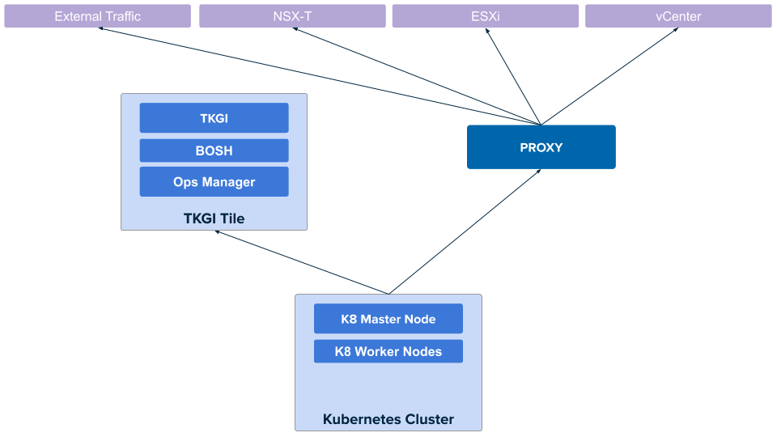

This topic describes how HTTP/HTTPS proxies work in {{  vars.product_full }} with NSX,
and how to set proxies globally.

To configure proxy settings specifically for individual {{ vars.product_short }} clusters, see [Configure Cluster Proxies](proxies-cluster.html).

##Overview

If your environment includes HTTP proxies, you can configure {{  vars.product }} with NSX to use these proxies so that {{  vars.product }}-deployed Kubernetes control plane and worker nodes access public Internet services and other internal services through a proxy.

In addition, {{  vars.product }} proxy settings apply to the {{ vars.product_short }} API instance.
When an {{  vars.product }} operator creates a Kubernetes cluster, the {{ vars.product_short }} API VM behind a proxy is able to manage NSX objects on the standard network.

You can also proxy outgoing HTTP/HTTPS traffic from {{ vars.platform_name }} and the BOSH Director so that all {{  vars.product }} components use the same proxy service.

The following diagram illustrates the network architecture:

{{{{raw}}}} <!-- = Image source: https://docs.google.com/presentation/d/1p2JE9iP-2Qz6tScmsyMucbaxKWYetMpG4eFhSPXgeZA/edit#slide=id.g8067ceefc5_2_0  --> {{{{/raw}}}}

## Enable {{ vars.product_short }} API and Kubernetes Proxy

To configure a global HTTP proxy for all outgoing HTTP/HTTPS traffic from the Kubernetes cluster nodes and the {{ vars.product_short }} API server, perform the following steps:

1. Navigate to {{ vars.platform_name }} and log in.

1. Click the **{{  vars.product }}** tile.

1. Click **Networking**.

1. Under **HTTP/HTTPS proxy**, select **Enabled**. When this option is enabled, you can proxy HTTP traffic, HTTPS traffic, or both.
{{> global-proxy }}

1. Save the changes to the {{  vars.product }} tile.

1. Proceed with any remaining {{  vars.product }} tile configurations and deploy {{  vars.product }}. See <a href="./installing-nsx-t.html">Installing {{  vars.product }} on vSphere with NSX</a>.

## Enable {{ vars.platform_name }} and BOSH Proxy

{{> proxy-ops-man }}

