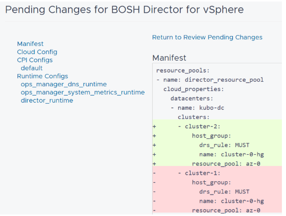

# Updating TKGi and BOSH After Renaming a vSphere Cluster

Renaming a vSphere cluster where {{ vars.product_full }} (TKGi) is deployed involves several steps due to how BOSH manages its deployments. If a cluster is renamed within vSphere, since {{ vars.platform_name }} does not permit direct editing of existing Availability Zones (AZs), the `installation.yml` file on the {{ vars.platform_name }} VM must be decrypted, edited to reflect the new cluster name, and then re-encrypted. This modification allows BOSH to recognize the cluster name change as a property update. Upon the next application of changes, all virtual machines within that deployment, including the BOSH Director VM if it resides on the renamed cluster, will undergo a complete drain, stop, and start cycle.

Perform the following steps to rename a vSphere cluster:

1. Login to the jump box, copy the public key for {{ vars.platform_name }} and save it to a file.

   For example, name the file, `ops-key`.

2. Change the file permission.

   ```
   chmod 600 ops-key
   ```

3. Use SSH to connect to the {{ vars.platform_name }} VM.

   ```
   ssh ubuntu@88.0.0.5 -i ops-key
   ```

4. Navigate to the `/tmp` directory.

   ```
   cd /tmp/
   ```

5. Decrypt the `installation.yml` file and copy it to `/tmp`.

   ```
   sudo -u tempest-web SECRET_KEY_BASE="s" RAILS_ENV=production /home/tempest-web/tempest/web/scripts/decrypt /var/tempest/workspaces/default/installation.yml /tmp/installation.yml
   ```

6. When prompted for the Decryption Passphrase, enter the {{ vars.platform_name }} login password.

7. Make a backup of the `installation.yml` file.

   ```
   sudo cp /tmp/installation.yml ~/installation-cp.yml
   ```

8. Edit the `installation.yml` file.

   You can use `vi` to edit it directly. Alternatively, use SCP to copy the file to a local server for editing. In this case rename the file in `/tmp` first:

   ```
   sudo mv installation.yml installation-orig.yml
   ```

   ```
   scp installation.yml <user>@10.159.151.181:/home/<user>/bosh_w/
   ```

9. Update the cluster name in `installation.yml`.

   You should see 4 lines in which the cluster name needs to be updated, similar to the following:

   ```
   Line 30:        cluster: <cluster_name>
   Line 39:        cluster: <cluster_name>
   Line 48:        cluster: <cluster_name>
   Line 1216:         value: <cluster_name>
   ```

10. Copy the `installation.yml` file back to the jump box and then to the {{ vars.platform_name }} VM.

   ```
   scp -i /home/kubo/ops-key installation.yml ubuntu@88.0.0.5:/tmp/
   ```

11. From the jump box, check the current list of BOSH tasks and make a note of the most recent task ID.

   ```
   bosh tasks -r=1000 -a (or) watch -n 5 bosh tasks --recent -a
   ```

12. Log in to vCenter and rename the cluster to the name you specified in `installation.yml`.

13. Encrypt the file to {{ vars.platform_name }}.

   ```
   sudo -u tempest-web SECRET_KEY_BASE="s" RAILS_ENV=production /home/tempest-web/tempest/web/scripts/encrypt /tmp/installation.yml /var/tempest/workspaces/default/installation.yml
   ```

   You should see the updated cluster name in the Bosh tile availability zone, but the changes are not yet applied.

14. Plan a maintenance widow and apply the changes.

   The pending changes are visible in {{ vars.platform_name }}:

   

   ~[Pending BOSH changes](./images/pending-changes-tkgi.png)

   Similar pending changes can be seen by running `watch -n 5 bosh tasks --recent -a` again, or in the {{ vars.platform_name }} change log.

The changes might take up to an hour before the renamed becomes accessible.

For more information about editing the `installation.yml`, see [KB 293641](https://knowledge.broadcom.com/external/article?articleId=293641).