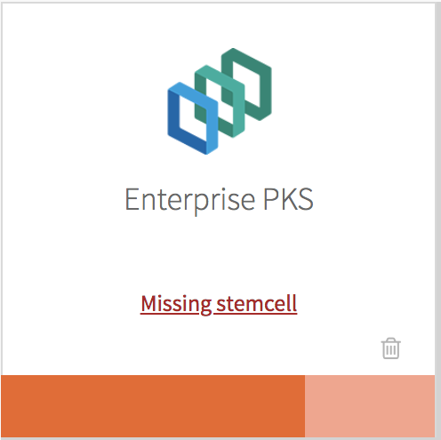

This topic explains how to upgrade {{  vars.product_full }} ({{ vars.product_short }}) in Antrea Networking environments from {{{ vars.product_version_prev }}} to {{{ vars.product_version }}}
on vSphere, Amazon Web Services (AWS), and Azure.

* [Overview](#overview)
* [Prepare to Upgrade](#prepare)
  * [Prepare to Upgrade with Multiple Datacenters](#prepare-multi-dc)
* [Perform the Upgrade](#upgrade)
  * [Upgrade {{ vars.platform_name }}](#upgrade-opsman)
  * [Download and Import {{ vars.product }} {{{ vars.product_version }}}](#upgrade-tile)
  * [Download and Import Stemcells](#stemcell)
  * [Modify Container Network Interface Configuration](#modify-cni)
  * [Verify Errand Configuration](#errands)
  * [Verify Other Configurations](#final-review)
  * [Apply Changes to the {{ vars.product }} Tile](#apply-changes)
* [After the Upgrade](#after-upgrade)
  * [Upgrade the TKGI and Kubernetes CLIs](#upgrade-clis)
  * [Verify the Upgrade](#verify-upgrade)

For instructions on upgrading {{  vars.product }}
on vSphere with NSX networking,
see [Upgrading {{  vars.product }} (NSX Networking)](upgrade-nsxt.html).

<strong>Note:</strong> You cannot directly upgrade to TKGI v1.22 from older build versions of the TKGI MC v1.21. See <a href="release-notes.html#1-22-0-no-upgrade-ova">Cannot upgrade to TKGI v1.22 from the TKGI MC v1.21 OVA</a> for workarounds.

<strong>Warning:</strong> Do not manually upgrade your Kubernetes version.
{{  vars.product }} includes the compatible Kubernetes version.

## Overview

Before you upgrade, follow the procedures in [Prepare to Upgrade](#prepare) below
to plan and prepare your upgrade.

After you complete the preparation steps,
continue to the procedures in [Perform the Upgrade](#upgrade) below.
These steps guide you through the process of upgrading {{ vars.platform_name }} and the {{  vars.product }} tile,
importing a new stemcell, and applying the changes to your deployment.

After you complete the upgrade, follow the procedures
in [After the Upgrade](#after-upgrade) below
to verify that your upgraded {{  vars.product }} deployment is running properly.

## Prepare to Upgrade

* If you have not already, complete all of the steps in
[Upgrade Preparation Checklist for {{{ vars.product_short }}}](checklist.html).
* To upgrade with multiple datacenters, see below.
  * You must use {{ vars.platform_name }}. You cannot upgrade on multiple datacenters using the Management Console.

### Prepare to Upgrade with Multiple Datacenters

{{> multi-dc-config }}

## Perform the Upgrade

This section describes the steps required to upgrade to {{  vars.product }} {{{ vars.product_version }}}:

1. [Upgrade {{ vars.platform_name }}](#upgrade-opsman)
1. [Download and Import {{  vars.product }} {{{ vars.product_version }}}](#upgrade-tile)
1. [Download and Import Stemcells](#stemcell)
1. [Modify Plan CNI Configuration](#modify-cni)
1. [Verify Errand Configuration](#errands)
1. [Verify Other Configurations](#final-review)
1. [Apply Changes to the {{  vars.product }} Tile](#apply-changes)

### Upgrade {{ vars.platform_name }}

Each version of {{  vars.product }} is compatible with multiple versions of {{ vars.platform_name }}.

<strong>Warning:</strong> If you use an automated pipeline to upgrade TKGI,
see <a href="upgrade-pipeline.html#configure-pipeline">Configure Automated {{ vars.platform_name }} and
Ubuntu Jammy Stemcell for VMware Tanzu Downloading</a> in <em>Configuring the Upgrade Pipeline</em>.

To determine {{ vars.platform_name }} compatibility and, if necessary, upgrade {{ vars.platform_name }}:

1. See [{{{ vars.product_network }}}](https://support.broadcom.com/group/ecx/productfiles?subFamily=Tanzu%20Kubernetes%20Grid%20Integrated%20Edition%20(TKGi)%20-%20CLI%20%26%20Tile&displayGroup=Tanzu%20Kubernetes%20Grid%20Integrated%20Edition%20(TKGi)%20-%20CLI%20%26%20Tile&release=1.22.2&os=&servicePk=&language=EN)
to determine if your {{ vars.platform_name }} version is compatible with {{  vars.product }} {{{ vars.product_version }}}.
1. If your {{ vars.platform_name }} version is not compatible with {{  vars.product }} {{{ vars.product_version }}},
follow the steps below.
1. Upgrade {{ vars.platform_name }}. For instructions, see
[Import Installation to {{ vars.platform_name }} v3.0 VM](https://techdocs.broadcom.com/us/en/vmware-tanzu/platform/tanzu-operations-manager/3-0/tanzu-ops-manager/install-upgrading-pcf.html#upgrade)
in _Upgrading {{ vars.platform_name }}_ in the {{ vars.platform_name }} documentation.
{{{{raw}}}} <!--  when editing this edit the other duplicate BELOW in this topic < %= partial 'add-clusters-workloads' % >  # --> {{{{/raw}}}}
1. Verify that the {{  vars.product }} control plane remains functional by performing the following steps:
    1. Add more workloads and create an additional cluster. For more information, see
<a href="maintain-uptime.html#upgrades">About Cluster Upgrades</a> in _Maintaining Workload Uptime_ and
<a href="create-cluster.html">Creating Clusters</a>.
    1. Monitor the {{  vars.product }} control plane in the <strong>{{  vars.product }}</strong> tile > <strong>Status</strong> tab.
    Review the load and resource usage data for the TKGI API and TKGI Database VMs.
    If any levels are at capacity, scale up the VMs.
     
{{{{raw}}}} <!--  when editing this edit the other duplicate BELOW in this topic < %= partial 'add-clusters-workloads' % >  # --> {{{{/raw}}}}

###  Download and Import {{  vars.product }} {{{ vars.product_version }}}

When you upgrade {{  vars.product }},
your configuration settings typically migrate to the new version automatically.
To download and import a {{  vars.product }} version:

1. Download the desired version of the product
from [{{{ vars.product_network }}}](https://support.broadcom.com/group/ecx/productdownloads?subfamily=Tanzu%20Kubernetes%20Grid%20Integrated%20Edition%20(TKGi)%20-%20CLI%20%26%20Tile).

1. Navigate to the {{ vars.platform_name }} Installation Dashboard and click **Import a Product**
to upload the product file.

1. Under the **Import a Product** button, click **+** next to **{{  vars.product }}**.
This adds the tile to your staging area.

###  Download and Import Stemcells

TKGI requires an Ubuntu Jammy Stemcell for VMware Tanzu.
A Windows 2019 Windows Stemcell for VMware Tanzu is also required if you intend to create Windows worker-based clusters.
For information about Windows stemcells, see
[Configuring Windows Worker-Based Clusters](windows-workers.html).

<strong>Warning:</strong> If you use an automated pipeline to upgrade TKGI,
see <a href="upgrade-pipeline.html#configure-pipeline">Configure Automated {{ vars.platform_name }}
and Ubuntu Jammy Stemcell Downloading</a> in <em>Configuring the Upgrade Pipeline</em>.

If {{ vars.platform_name }} does not have the Ubuntu Jammy Stemcell for VMware Tanzu required for {{  vars.product }} {{{ vars.product_version }}},
the {{  vars.product }} tile displays the message **Missing stemcell**.
To download and import a new Ubuntu Jammy Stemcell for VMware Tanzu, follow the steps below:

1. On the {{  vars.product }} tile, click the **Missing stemcell** link.

    

1. In the **Stemcell Library**, locate the **{{  vars.product }}** tile and note the required stemcell version.

1. Navigate to the [Stemcells (Ubuntu Jammy)](https://support.broadcom.com/group/ecx/productdownloads?subfamily=Stemcells%20(Ubuntu%20Jammy)) page on {{{ vars.product_network }}}
and download the required stemcell version for your IaaS.

1. Return to the **Installation Dashboard** in {{ vars.platform_name }} and click **Stemcell Library**.

1. On the **Stemcell Library** page, click **Import Stemcell** and select the stemcell file you downloaded from {{{ vars.product_network }}}.

1. Select the {{  vars.product }} tile and click **Apply Stemcell to Products**.

1. Verify that {{ vars.platform_name }} successfully applied the stemcell. The stemcell version you imported and applied appears in the **Staged** column for {{  vars.product }}.

1. Return to the **Installation Dashboard**.

### Modify Container Network Interface Configuration

{{  vars.product }} supports using the Antrea Container Network Interface (CNI) as
the CNI for new TKGI-provisioned clusters.

To configure {{  vars.product }} to use Antrea as the CNI for new clusters:

1. In the **Installation Dashboard**, click **Networking**.
1. Under **Container Networking Interface**, select **Antrea**.
1. Confirm the remaining Container Networking Interface settings.
1. Click **Save**.

### Verify Errand Configuration

To verify your **Errands** pane is correctly configured, do the following:

1. In the **{{  vars.product }}** tile, click **Errands**.

1. Under **Post-Deploy Errands**:
    * Review the **Upgrade all clusters** errand:
        * If you want to upgrade the {{  vars.product }} tile and all your existing Kubernetes clusters simultaneously,
        confirm that **Upgrade all clusters errand** is set to **Default (On)**.
        The errand upgrades all clusters.
        Upgrading {{  vars.product }}-provisioned Kubernetes clusters can temporarily interrupt the service
        as described in [Service Interruptions](interruptions.html).
        * If you want to upgrade the {{  vars.product }} tile only and
        then upgrade your existing Kubernetes clusters separately, deactivate **Upgrade all clusters errand**.
        For more information, see [Upgrading Clusters](upgrade-clusters.html).
        
<strong>Warning:</strong> Deactivating the <strong>Upgrade all clusters errand</strong>
        causes the TKGI version tagged in your Kubernetes clusters to fall behind
        the {{  vars.product }} tile version.
        If you deactivate the <strong>Upgrade all clusters errand</strong>
        when upgrading the {{  vars.product }} tile,
        you must upgrade all your Kubernetes clusters before the next {{  vars.product }}
        upgrade.

    * Configure the **Run smoke tests** errand:

        * Set the **Run smoke tests** errand to **On**.
        The errand uses the {{  vars.product }} Command Line Interface (TKGI CLI) to create a
        Kubernetes cluster and then delete it. If the creation or deletion fails, the errand fails and
        the installation of the {{  vars.product }} tile is aborted.

1. Click **Save**.

### Verify Other Configurations
To confirm your other **{{  vars.product }}** tile panes are correctly configured, do the following:

1. Review the **Assign AZs and Networks** pane.
    
<strong>Note:</strong> When you upgrade {{  vars.product }}, you must place singleton jobs in the AZ you selected when you first installed the {{  vars.product }} tile. You cannot move singleton jobs to another AZ.

1. Review the other configuration panes.
1. Make changes where necessary.

<strong>WARNING</strong>: Do not change the number of control plane/etcd nodes
for any plan that was used to create currently-running clusters.
{{  vars.product }} does not support changing the number of control plane/etcd nodes for plans
with existing clusters.

1. Click **Save** on any panes where you make changes.

### Apply Changes to the {{  vars.product }} Tile

To complete the upgrade of the {{  vars.product }} tile:

1. Return to the **Installation Dashboard** in {{ vars.platform_name }}.

1. Click **Review Pending Changes**.
     For more information about this {{ vars.platform_name }} page, see
    [Reviewing Pending Product Changes](https://techdocs.broadcom.com/us/en/vmware-tanzu/platform/tanzu-operations-manager/3-0/tanzu-ops-manager/install-review-pending-changes.html).

1. Click **Apply Changes**.

1. (Optional) To monitor the progress of the **Upgrade all clusters errand** using the BOSH CLI, do the following:
      1. Log in to the BOSH Director by running `bosh -e MY-ENVIRONMENT log-in` from a VM that can access your {{  vars.product }} deployment. For more information, see [Using BOSH Diagnostic Commands in {{  vars.product }}](diagnostic-tools.html).
      1. Run `bosh -e MY-ENVIRONMENT tasks`.
      1. Locate the task number for the errand in the <strong>&#35;</strong> column of the BOSH output.
      1. Run `bosh task TASK-NUMBER`, replacing `TASK-NUMBER` with the task number you located in the previous step.

## After the Upgrade

After you complete the upgrade to {{  vars.product }} {{{ vars.product_version }}},
complete the following verifications and upgrades:

- [Upgrade the TKGI and Kubernetes CLIs](#upgrade-clis)
- [Verify the Upgrade](#verify-upgrade)

### Upgrade the TKGI and Kubernetes CLIs

Upgrade the TKGI and Kubernetes CLIs on any local machine
where you run commands that interact with your upgraded version of {{  vars.product }}.

To upgrade the CLIs, download and re-install the TKGI and Kubernetes CLI distributions
that are provided with {{  vars.product }} on {{{ vars.product_network }}}.

For more information about installing the CLIs, see the following topics:

* [Installing the TKGI CLI](installing-cli.html)

* [Installing the Kubernetes CLI](installing-kubectl-cli.html)

### Verify the Upgrade

After you apply changes to the {{  vars.product }} tile and the upgrade is complete,
do the following:

1. Verify that your Kubernetes environment is healthy. To verify the health of your Kubernetes environment, see [Verifying
Deployment Health](./verify-health.html).

    For any cluster upgrade that fails, you can use the BOSH ID of the upgrade task for debugging.
    To retrieve the BOSH task ID,
    see [Retrieve Cluster Upgrade Task ID](./verify-health.html#upgrade-code) in _Verifying Deployment Health_.

{{{{raw}}}} <!--  when editing this edit the other duplicate ABOVE in this topic < %= partial 'add-clusters-workloads' % >  # --> {{{{/raw}}}}
1. Verify that the {{  vars.product }} control plane remains functional by performing the following steps:
    1. Add more workloads and create an additional cluster. For more information, see
<a href="maintain-uptime.html#upgrades">About Cluster Upgrades</a> in _Maintaining Workload Uptime_ and
<a href="create-cluster.html">Creating Clusters</a>.
    1. Monitor the {{  vars.product }} control plane in the <strong>{{  vars.product }}</strong> tile > <strong>Status</strong> tab.
    Review the load and resource usage data for the TKGI API and TKGI Database VMs.
    If any levels are at capacity, scale up the VMs.
     
{{{{raw}}}} <!--  when editing this edit the other duplicate ABOVE in this topic < %= partial 'add-clusters-workloads' % >  # --> {{{{/raw}}}}
