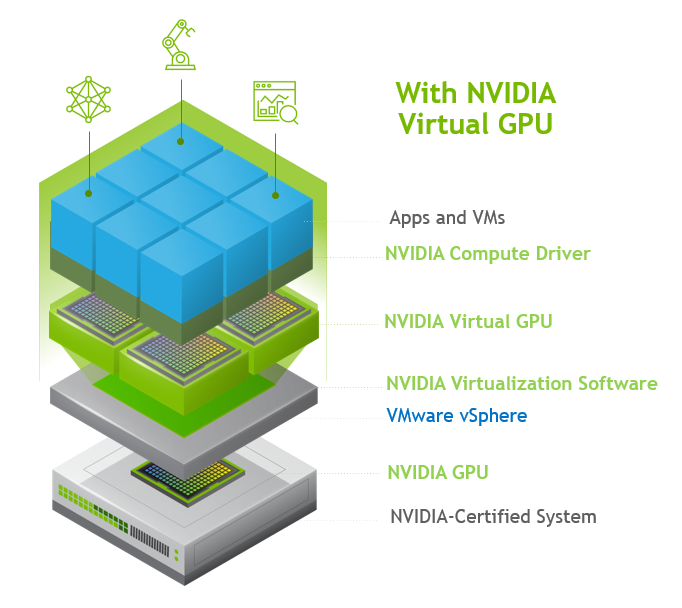
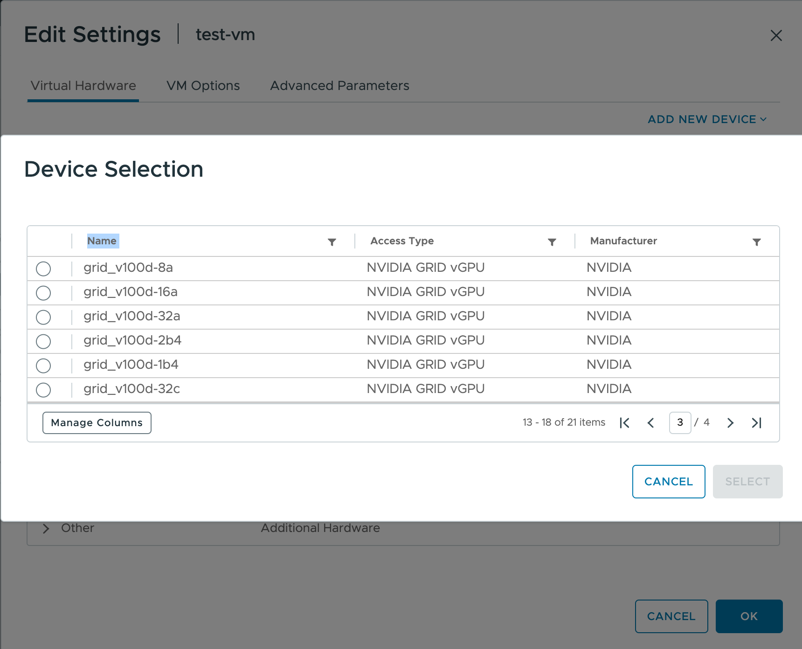
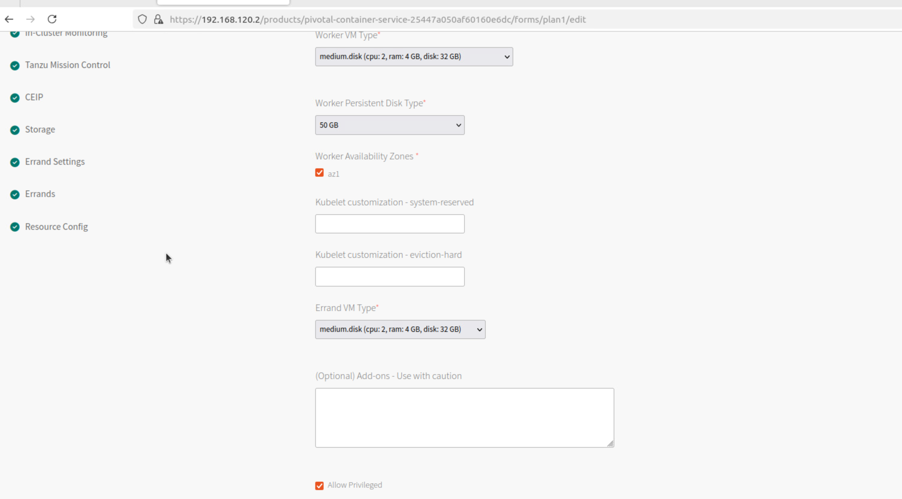

# Create vGPU Clusters

This page explains how to create TKGI clusters on vSphere that run NVIDIA vGPU worker nodes.
Applications hosted on these clusters access GPU functionality via Compute Unified Device Architecture (CUDA).

To run NVIDIA GPU worker nodes, see [Create GPU Clusters](gpu.html).

## <a id="overview"></a> Overview

To create a CUDA-enabled GPU cluster with TKGI on vSphere, you:

1. Plug compatible GPU cards into your ESXi hosts.
1. Configure PCI passthrough for the cards, and retrieve the `vendor_id` and `device_id` that identify them.
1. Configure a BOSH VM Extension for a VM instance group that uses the GPUs, as set by `pci_passthroughs`.
1. (Optional) To enable the cluster to run workloads on either non-GPU or GPU processors, configure a compute profile that defines both non-GPU and GPU node pools.
1. Create the cluster.
1. Install the [NVIDIA GPU Operator](https://docs.nvidia.com/datacenter/cloud-native/gpu-operator/latest/overview.html) on the cluster to integrate the GPU with Kubernetes.
  - By default, the NVIDIA GPU Operator installs a default GPU driver on worker nodes, but you can also customize the GPU driver image.

  

## <a id="prereqs"></a> Prerequisites

* TKGI v1.20 or later
* NVIDIA GPU cards from G8x series or later, such as GeForce, Quadro, or Tesla
  * These cards support CUDA.
* ESXi hosts running vSphere 7.0 Update 3 or later
  * For ESXi I/O requirements, see [vSphere VMDirectPath I/O and Dynamic DirectPath I/O: Requirements for Platforms and Devices](https://knowledge.broadcom.com/external/article/312208/) in the Broadcom Support Knowledge Base.
  * Listed below are the builds for 7.0u3, which is the minimum required to support GPU clusters.
      * [VMware vCenter Server 7.0 Update 3 | ISO Build 18700403](https://docs.vmware.com/en/VMware-vSphere/7.0/rn/vsphere-vcenter-server-703-release-notes.html).
      * [VMware ESXi 7.0 Update 3c | ISO Build 19193900](https://docs.vmware.com/en/VMware-vSphere/7.0/rn/vsphere-esxi-70u3c-release-notes.html)
* NVIDIA license server and software, installed as described below:
  * NVIDIA license server
  * NVIDIA AI Enterprise Software
      * Host driver for vGPU installed on ESXi hosts
      * Guest driver for vGPU, used in custom driver image
  * A private image registry such as Harbor; see [Getting Started with VMware Harbor Registry](harbor.html)
      * Used to host the custom driver image.


## <a id="hardware"></a> Prepare the Hardware

To prepare GPU hardware for supporting TKGI clusters with CUDA:

1. Plug the GPU cards into your ESXi hosts.
  - To simplify management, VMware recommends grouping the hosts that have GPUs into the same vSphere cluster, so they run within a single availability zone (AZ).

1. Install NVIDIA software for vGPU as described in the sections below.
  - PCI passthrough software for GPU and software for vGPU are mutually exclusive; on any ESXi host, you can deploy clusters with GPU workers or vGPU workers, but not both.


## <a id="nvidia-software"></a> Install NVIDIA Software

To prepare NVIDIA hardware for GPU, install NVIDIA vGPU software on ESXi host and set up license server:

1. Find a supported NVIDIA AI Enterprise vGPU driver for your ESXi version, vCenter version, and vGPU card by referring to [NVIDIA AI Enterprise Product Support Matrix](https://docs.nvidia.com/ai-enterprise/5.1/product-support-matrix/index.html).
1. For the appropriate version of the NVAIe vGPU software, follow NVIDIA instructions to [Download vGPU Software](https://docs.nvidia.com/datacenter/cloud-native/gpu-operator/latest/install-gpu-operator-vgpu.html#download-vgpu-software).
1. Install the NVIDIA GPU vSphere Installation Bundle (VIB) on your ESXi Host, as described in [Installing and configuring the NVIDIA VIB on ESXi](https://knowledge.broadcom.com/external/article?legacyId=2033434) in the Broadcom Support knowledge base.
  - Download a host driver for the AI Enterprise series.
  > **Note** It is critical that the guest driver and ESXi host driver / VIB come from the same NVIDIA software release.
1. Install the `mgmtdaemon` VIB to your ESXi host, after the vGPU host driver is installed.
1. After the host driver and `mgmtdaemon` are installed on ESXi:
  - In vCenter > **Configure** > **Graphics** > **Device**, make sure the mode is "Shared Direct". For example: `graphics_shared_type`.
  - In vCenter, make sure that PCI passthrough is disabled for the GPU.
  - You should now be able to see and choose vGPU profiles when you create VMs from the "ADD PCI DEVICE".
      - The vGPU profiles are hardware-dependent, so look up support on the NVIDIA site.
      - Choose vGPU profiles in the `C` series, which are for CUDA applications.

      

**Upgrading**: When you upgrade the ESXi host, remove the old drivers in the opposite order from installation, `mgmtdaemon` first and then the host driver, before you install new drivers.

  1. Install an NVIDIA license server, either in the cloud (CLS) or on-premises (DLS) on your ESXi host:
      * **Cloud**: See [Configuring a CLS Instance](https://docs.nvidia.com/license-system/latest/nvidia-license-system-quick-start-guide/index.html#configuring-cls-instance)
      * **On-premises**: See [Configuring a DLS Instance](https://docs.nvidia.com/license-system/latest/nvidia-license-system-quick-start-guide/index.html#configuring-dls-instance)


## <a id="extension"></a>Configure BOSH VM Extension

You configure a Kubernetes cluster to have vGPU-based workers by defining an instance group with VM extensions `vm_extensions.vgpu` values.
See [Using BOSH VM Extensions](bosh-vm-extensions.html) for how to create the VM extension.

The instance group's `name` value must start with `worker`, to specify that it applies to worker nodes.

You can define the instance groups using either YAML or JSON format.
The formats differ in how you set the ID values:

* YAML: Hexadecimal, e.g. `0x10de`; prepend `0x` to the vSphere client listing
* JSON: Decimal, e.g. `4318`; convert from the vSphere client listing

For example:

* **YAML**:

  ```yaml
  ---
  # vgpu-extension-8c.yml
  instance_groups:
  - name: worker
    vm_extension:
      cpu: 8
      ram: 16384
      vgpus:
      - grid_v100d-8c
      vmx_options:
        disk.enableUUID: '1'
        pciPassthru.use64bitMMIO: 'TRUE'
        pciPassthru.64bitMMIOSizeGB: 128
  ```

* **JSON**:

  ```json
  {
    "instance_groups": [
      {
        "name": "worker",
        "vm_extension": {
          "cpu": 8,
          "ram": 16384,
          "vgpus": [
            "grid_v100d-8c"
          ],
          "vmx_options": {
            "disk.enableUUID": "1",
            "pciPassthru.use64bitMMIO": "TRUE",
            "pciPassthru.64bitMMIOSizeGB": 128
          }
        }
      }
    ]
  }
  ```

To use vGPU for worker nodes in a VM pool `gpu-pool` referenced by a compute profile:

```yml
# vgpu-extension-cp-8c.yml
---
instance_groups:
- name: master
  vm_extension:
    vmx_options:
      disk.enableUUID: '1'
- name: worker-gpu-pool
  vm_extension:
    cpu: 8
    ram: 16384
    vgpus:
    - grid_v100d-8c
    vmx_options:
      disk.enableUUID: '1'
      pciPassthru.use64bitMMIO: 'TRUE'
      pciPassthru.64bitMMIOSizeGB: 128
```

Configure `vmx_options` as described in [`vmx_options` Extension Options](gpu.html/#vmx) on the _Create GPU Clusters_ page.


## <a id="cp"></a>(Optional) Configure Compute Profile for vGPU

To create a Kubernetes cluster with both GPU and non-GPU worker nodes, configure a compute profile and custom AZs that define separate node pools, one for each worker type, as described in [Create a Compute Profile](compute-profiles-manage.html#create).

Without a compute profile, the cluster you create will only have GPU workers.

For example, to use node pool `gpu-pool` defined in extension `vgpu-extension-cp-8c.yml` above to create a Kubernetes cluster with two node pools, one for regular workers, and one for vGPU workers, define a compute profile as follows:

```json
{
    "name": "gpu-compute-profile",
    "description": "gpu-compute-profile",
    "parameters": {
        "cluster_customization": {
            "node_pools": [
                {
                    "name": "normal-pool",
                    "instances": 1,
                    "max_worker_instances": 3
                },
                {
                    "name": "gpu-pool",
                    "instances": 1,
                    "max_worker_instances": 3
                }
            ]
        }
    }
}
```

The pool name in the compute profile should be the same as its name in the VM extension but without `worker-` prepended.

> **Note** Do not use multiple vGPU profiles on a worker. If you need a vGPU with 8G memory, use an 8G profile, not two 4G profiles.

## <a id="create"></a>Create vGPU Cluster

Before you create a vGPU cluster, make sure that the plan you will use to create the cluster is configured with **Allow Privileged** enabled.
For more information, see [Plans](installing-vsphere.html#plans) in _Installing Tanzu Kubernetes Grid Integrated Edition on vSphere_.    

  

How you create the cluster depends on whether you defined a compute profile:

* **With compute profile**:

  1. Create the compute profile:

      ```
      tkgi create-compute-profile  ~/work/x/tkgi-gpu/src/tkgi/gpu-compute-profile.json
      ```

  1. Create the cluster with the profile:


      ```bash
      # create compute profiles
      tkgi create-compute-profile gpu-compute-profile.json
      # GPU cluster with grid_v100d-8c
      tkgi create-cluster g1-8c \
       --external-hostname g1-8c.example.com \
       --plan small \
       --compute-profile gpu-compute-profile \
       --config-file vgpu-extension-8c.yml \
       --num-nodes 1
      ```

* **No compute profile**:

  1. Create the vGPU-only cluster:

      ```bash
      # GPU cluster with grid_v100d-8c profile
      tkgi create-cluster g1-8c \
       --external-hostname g1-8c.example.com \
       --plan small \
       --config-file vgpu-extension-8c.yml \
       --num-nodes 1
      ```

## <a id="driver"></a> Build and Store Guest Driver Image

The guest driver image, stored in the registry, enables the guest driver to be installed on vGPU worker nodes.
The guest driver binary version must match the version of the host driver.

To build and store the guest driver image:

1. From the NVAIe vGPU software that you downloaded in [Install NVIDIA Software for vGPU](#nvidia-software) and obtained the host driver from, find the guest driver.
1. Build a custom driver image by following[Build the Driver Container]](https://docs.nvidia.com/datacenter/cloud-native/gpu-operator/latest/install-gpu-operator-vgpu.html#build-the-driver-container) in the NVIDIA documentation.
1. Upload the guest driver image to the private image registry, so that TKGI can access it when it creates VMs.
1. Configure vGPU License and driver information as described in [Configure the Cluster with the vGPU License Information and the Driver Container Image](https://docs.nvidia.com/datacenter/cloud-native/gpu-operator/latest/install-gpu-operator-vgpu.html#configure-the-cluster-with-the-vgpu-license-information-and-the-driver-container-image) in the NVIDIA documentation.

## <a id="operator"></a>Install GPU Kubernetes Operator

To enable GPU integration and vGPU management with the Kubernetes environment, NVIDIA provides a [GPU Operator](https://docs.nvidia.com/datacenter/cloud-native/gpu-operator/latest/overview.html) Helm chart.
The GPU Operator enables driver lifecycle management, node labeling, container-toolkit installation, etc.

To install the GPU Operator to the cluster, follow [Installing the NVIDIA GPU Operator](https://docs.nvidia.com/datacenter/cloud-native/gpu-operator/latest/getting-started.html#operator-install-guide).

To customize the Helm chart installation to suit your needs, refer to [Common Chart Customization Options](https://docs.nvidia.com/datacenter/cloud-native/gpu-operator/latest/getting-started.html#chart-customization-options) in the NVIDIA documentation.

The following are sample commands for installing the NVIDIA GPU Operator:

```bash
# install helm if not done already:
curl -fsSL -o get_helm.sh https://raw.githubusercontent.com/helm/helm/master/scripts/get-helm-3 \
    && chmod 700 get_helm.sh \
    && ./get_helm.sh

# Add the NVIDIA Helm repository:
helm repo add nvidia https://helm.ngc.nvidia.com/nvidia \
    && helm repo update


# https://docs.nvidia.com/datacenter/cloud-native/gpu-operator/latest/install-gpu-operator-vgpu.html
# Install GPU operator

# vgpu
export PRIVATE_REGISTRY=<Your Private Registry>
export VERSION=535.216.01
export CUDA_VERSION=12.6.3
export VGPU_DRIVER_VERSION=535.216.01-grid
export GOLANG_VERSION=1.22.9

kubectl create namespace gpu-operator

kubectl create configmap licensing-config \
    -n gpu-operator --from-file=gridd.conf --from-file=client_configuration_token.tok

export REGISTRY_SECRET_NAME=registry-secret

kubectl create secret docker-registry ${REGISTRY_SECRET_NAME} \
    --docker-server=${PRIVATE_REGISTRY} --docker-username=<username> \
    --docker-password=<password> \
    --docker-email=<email-id> -n gpu-operator

# Use chart 24.6.2 to work round the issue, https://github.com/NVIDIA/gpu-operator/issues/1109
helm install --wait --generate-name \
  -n gpu-operator \
    nvidia/gpu-operator \
    --version 24.6.2 \
    --set driver.enabled=true \
    --set toolkit.enabled=true \
    --set driver.repository=${PRIVATE_REGISTRY} \
    --set driver.version=${VERSION} \
    --set driver.imagePullSecrets=${REGISTRY_SECRET_NAME} \
    --set driver.licensingConfig.configMapName=licensing-config \
    --set toolkit.env[0].name=CONTAINERD_CONFIG \
    --set toolkit.env[0].value=/var/vcap/jobs/containerd/config/config.toml \
    --set toolkit.env[1].name=CONTAINERD_SOCKET \
    --set toolkit.env[1].value=/var/vcap/sys/run/containerd/containerd.sock \
    --set toolkit.env[2].name=CONTAINERD_RUNTIME_CLASS \
    --set toolkit.env[2].value=nvidia \
    --set toolkit.env[3].name=CONTAINERD_SET_AS_DEFAULT \
    --set-string toolkit.env[3].value="true"
```

## <a id="verify-operator"></a> Verify Operator

After the GPU Operator is successfully installed, you can run a verification workload to make sure it is successful.

To check CUDA capability, use [cuda-vectoradd](https://docs.nvidia.com/datacenter/cloud-native/gpu-operator/latest/getting-started.html#cuda-vectoradd).

To see node device information, create and use a pod defined as follows:

```yml
---
# "nvidia-smi -q"
apiVersion: v1
kind: Pod
metadata:
  name: nvidia-smi
spec:
  runtimeClassName: nvidia
  restartPolicy: OnFailure
  containers:
  - name: nvidia-smi
    image: "nvidia/cuda:12.2.2-base-ubuntu22.04"
    command: ["nvidia-smi", "-q"]
    resources:
      limits:
        nvidia.com/gpu: 1
```

Pay attention to the `License Status` listing.
If `License Status` is not listed as `Licensed`, worker nodes may be subject to throttling by NVIDIA.

```
    vGPU Software Licensed Product
        Product Name                      : NVIDIA Virtual Compute Server
        License Status                    : Licensed (Expiry: 2025-3-19 7:29:4 GMT)
```


Here is sample output from `nvidia-smi -q`.

```bash
adamz@jbox:~/work/gpu$ kubectl logs nvidia-smi

==============NVSMI LOG==============

Timestamp                                 : Thu Dec 19 07:31:27 2024
Driver Version                            : 535.216.01
CUDA Version                              : 12.2

Attached vGPUs                             : 1
GPU 00000000:02:00.0
    Product Name                          : GRID V100D-8C
    Product Brand                         : NVIDIA Virtual Compute Server
    Product Architecture                  : Volta
    Display Mode                          : Enabled
    Display Active                        : Disabled
    Persistence Mode                      : Enabled
    Addressing Mode                       : N/A
    MIG Mode
        Current                           : Disabled
        Pending                           : Disabled
    Accounting Mode                       : Disabled
    Accounting Mode Buffer Size           : 4000
    Driver Model
        Current                           : N/A
        Pending                           : N/A
    Serial Number                         : N/A
    GPU UUID                              : GPU-57abc772-1dd3-11b2-8fae-e31710b8f307
    Minor Number                          : 0
    VBIOS Version                         : 00.00.00.00.00
    MultiGPU Board                        : No
    Board ID                              : 0x200
    Board Part Number                     : N/A
    GPU Part Number                       : 1DB6-897-A1
    FRU Part Number                       : N/A
    Module ID                             : N/A
    Inforom Version
        Image Version                     : N/A
        OEM Object                        : N/A
        ECC Object                        : N/A
        Power Management Object           : N/A
    Inforom BBX Object Flush
        Latest Timestamp                  : N/A
        Latest Duration                   : N/A
    GPU Operation Mode
        Current                           : N/A
        Pending                           : N/A
    GSP Firmware Version                  : N/A
    GPU Virtualization Mode
        Virtualization Mode               : VGPU
        Host VGPU Mode                    : N/A
    vGPU Software Licensed Product
        Product Name                      : NVIDIA Virtual Compute Server
        License Status                    : Licensed (Expiry: 2025-3-19 7:29:4 GMT)
    GPU Reset Status
        Reset Required                    : N/A
        Drain and Reset Recommended       : N/A
    IBMNPU
        Relaxed Ordering Mode             : N/A
    PCI
        Bus                               : 0x02
        Device                            : 0x00
        Domain                            : 0x0000
        Device Id                         : 0x1DB610DE
        Bus Id                            : 00000000:02:00.0
        Sub System Id                     : 0x139610DE
        GPU Link Info
            PCIe Generation
                Max                       : N/A
                Current                   : N/A
                Device Current            : N/A
                Device Max                : N/A
                Host Max                  : N/A
            Link Width
                Max                       : N/A
                Current                   : N/A
        Bridge Chip
            Type                          : N/A
            Firmware                      : N/A
        Replays Since Reset               : N/A
        Replay Number Rollovers           : N/A
        Tx Throughput                     : N/A
        Rx Throughput                     : N/A
        Atomic Caps Inbound               : N/A
        Atomic Caps Outbound              : N/A
    Fan Speed                             : N/A
    Performance State                     : P0
    Clocks Event Reasons                  : N/A
    Sparse Operation Mode                 : N/A
    FB Memory Usage
        Total                             : 8192 MiB
        Reserved                          : 560 MiB
        Used                              : 0 MiB
        Free                              : 7631 MiB
    BAR1 Memory Usage
        Total                             : 8192 MiB
        Used                              : 0 MiB
        Free                              : 8192 MiB
    Conf Compute Protected Memory Usage
        Total                             : 0 MiB
        Used                              : 0 MiB
        Free                              : 0 MiB
    Compute Mode                          : Default
    Utilization
        Gpu                               : 0 %
        Memory                            : 0 %
        Encoder                           : 0 %
        Decoder                           : 0 %
        JPEG                              : N/A
        OFA                               : N/A
    Encoder Stats
        Active Sessions                   : 0
        Average FPS                       : 0
        Average Latency                   : 0
    FBC Stats
        Active Sessions                   : 0
        Average FPS                       : 0
        Average Latency                   : 0
    ECC Mode
        Current                           : Enabled
        Pending                           : Enabled
    ECC Errors
        Volatile
            Single Bit            
                Device Memory             : 0
                Register File             : 0
                L1 Cache                  : 0
                L2 Cache                  : 0
                Texture Memory            : N/A
                Texture Shared            : N/A
                CBU                       : N/A
                Total                     : 0
            Double Bit            
                Device Memory             : 0
                Register File             : 0
                L1 Cache                  : 0
                L2 Cache                  : 0
                Texture Memory            : N/A
                Texture Shared            : N/A
                CBU                       : 0
                Total                     : 0
        Aggregate
            Single Bit            
                Device Memory             : 0
                Register File             : 0
                L1 Cache                  : 0
                L2 Cache                  : 0
                Texture Memory            : N/A
                Texture Shared            : N/A
                CBU                       : N/A
                Total                     : 0
            Double Bit            
                Device Memory             : 0
                Register File             : 0
                L1 Cache                  : 0
                L2 Cache                  : 0
                Texture Memory            : N/A
                Texture Shared            : N/A
                CBU                       : 0
                Total                     : 0
    Retired Pages
        Single Bit ECC                    : 0
        Double Bit ECC                    : 0
        Pending Page Blacklist            : No
    Remapped Rows                         : N/A
    Temperature
        GPU Current Temp                  : N/A
        GPU T.Limit Temp                  : N/A
        GPU Shutdown Temp                 : N/A
        GPU Slowdown Temp                 : N/A
        GPU Max Operating Temp            : N/A
        GPU Target Temperature            : N/A
        Memory Current Temp               : N/A
        Memory Max Operating Temp         : N/A
    GPU Power Readings
        Power Draw                        : N/A
        Current Power Limit               : N/A
        Requested Power Limit             : N/A
        Default Power Limit               : N/A
        Min Power Limit                   : N/A
        Max Power Limit                   : N/A
    Module Power Readings
        Power Draw                        : N/A
        Current Power Limit               : N/A
        Requested Power Limit             : N/A
        Default Power Limit               : N/A
        Min Power Limit                   : N/A
        Max Power Limit                   : N/A
    Clocks
        Graphics                          : 1230 MHz
        SM                                : 1230 MHz
        Memory                            : 877 MHz
        Video                             : 1110 MHz
    Applications Clocks
        Graphics                          : N/A
        Memory                            : N/A
    Default Applications Clocks
        Graphics                          : N/A
        Memory                            : N/A
    Deferred Clocks
        Memory                            : N/A
    Max Clocks
        Graphics                          : N/A
        SM                                : N/A
        Memory                            : N/A
        Video                             : N/A
    Max Customer Boost Clocks
        Graphics                          : N/A
    Clock Policy
        Auto Boost                        : N/A
        Auto Boost Default                : N/A
    Voltage
        Graphics                          : N/A
    Fabric
        State                             : N/A
        Status                            : N/A
    Processes                             : None
```


## Troubleshooting

If you failed to obtain a license, please check /var/log/syslog of worker node, see if it is network error or license server error.

## Resources

- [install-gpu-operator-vgpu](https://docs.nvidia.com/datacenter/cloud-native/gpu-operator/latest/install-gpu-operator-vgpu.html)
- [VM Direct passthrough](https://knowledge.broadcom.com/external/article?legacyId=2142307)
- [driver installation](https://www.youtube.com/watch?v=gJy2dS20so8)
- [setup license service](https://www.youtube.com/watch?v=7NRKyXl9j6U)

