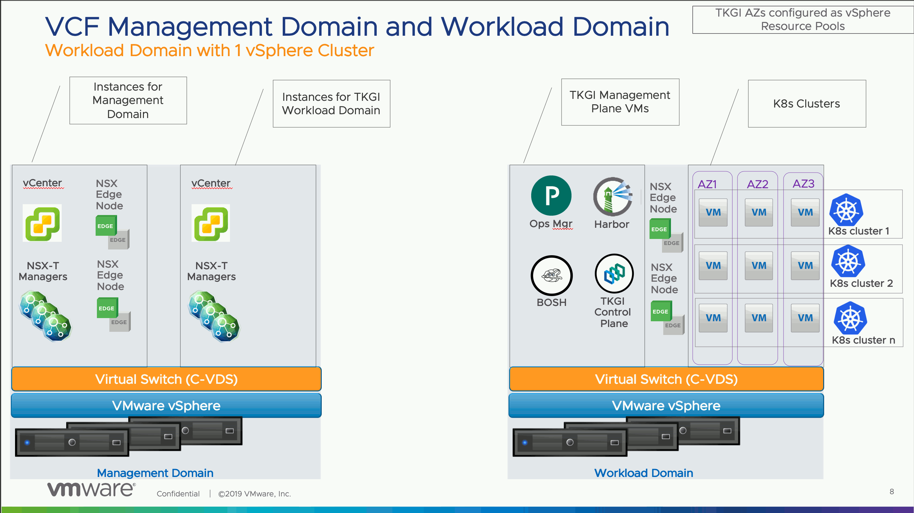
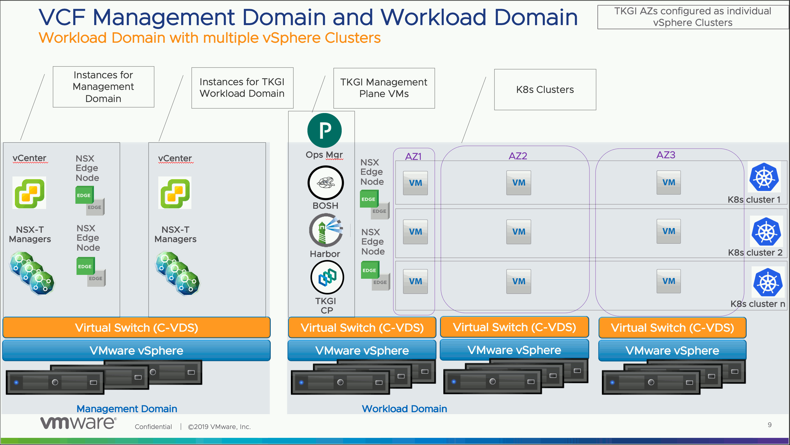

This topic describes how to install and operate {{  vars.product_full }}
on the VMware Cloud Foundation (VCF) platform.

<strong>Warning:</strong>
VCF 5.0 is supported with {{ vars.product_short }} {{{ vars.product_version }}}, but has not been tested.

## About {{ vars.product_short }} Integration with VCF

VMware Cloud Foundation (VCF) is a unified SDDC platform that brings together vSphere, vSAN, NSX, and vRealize components into an integrated stack to deliver enterprise-ready infrastructure for private and public clouds. For more information,
see the [VCF Documentation](https://techdocs.broadcom.com/us/en/vmware-cis/vcf/vcf-5-2-and-earlier/5-2.html).

You can install {{  vars.product }} on VCF. You can use either the [{{ vars.product_short }} Management Console](console-install-vsphere.html) or [{{ vars.platform_name }}](vsphere-nsxt-index.html) to install {{ vars.product_short }} on VCF. The installation procedure on the VCF platform is generally the same as the installation procedure without VCF.

For more information, see:

* [Requirements for Installing {{ vars.product_short }} on VCF](#vcf-requirements)
* [Supported Topologies for {{ vars.product_short }} on VCF](#vcf-topos)
* [{{ vars.product_short }} on VCF Deployment Procedure](#vcf-deployment)

##  Requirements for Installing {{ vars.product_short }} on VCF

To install {{ vars.product_short }} on VCF, you must adhere to the following requirements:

- Deploy only the supported versions of {{ vars.product_short }} and VCF. See the [Release Notes](./release-notes.html) for precise version compatibility.

- Deploy vSphere 7.x with NSX-T 3.x using a converged VDS for vSphere and NSX traffic. You cannot use an N-VDS for NSX transport node traffic. Because of this requirement, a fresh installation is required. There is no way to migrate from N-VDS to VDS.

- Deploy {{ vars.product_short }} in the Workload domain only. VCF creates domains, including a Management and Workload domain. {{ vars.product_short }} components, including {{ vars.platform_name }}, BOSH Director, {{ vars.product_short }} API and DB, and Harbor, must be installed into the Workload domain.

- Deploy {{ vars.product_short }} using a single vSphere cluster, if you are using the {{ vars.product_short }} Management Console. The reason is that currently the {{ vars.product_short }} Management Console does not support using multiple converged VDSes. If you are using {{ vars.platform_name }}, you can use multiple vSphere clusters (with separate VDSes) as long as you are using a shared datastore (vSAN) to support PersistentVolumes.

- When deploying {{ vars.product_short }} on VCF, do not generate a new certificate for NSX Manager. If you do it will break the VCF to NSX Manager communication. You must use the existing NSX Manager certificate when configuring {{ vars.product_short }}.

- You must deploy the NSX Management plane in the VCF Management Domain using a VIP and an external load balancer in front of the NSX Manager nodes. See [Configuring an NSX Management Plane Load Balancer](./nsxt-mgmt-lb.html) for more information.

- You can use the Management Console or {{ vars.platform_name }} to deploy {{ vars.product_short }} on VCF, but there is a dependency on the type of [topology](#vcf-topos) you want to deploy.

## Supported Topologies for {{ vars.product_short }} on VCF

{{ vars.product_short }} supports two topologies for VCF: a Workload Domain with a single vSphere Cluster and a Workload Domain with multiple vSphere clusters.

### Topology 1: Workload Domain with a Single vSphere Cluster

This topology provides a single vSphere cluster in the Workload Domain managed by the vCenter Server instance on the Management Domain. This is topology is supported by the {{ vars.product_short }} Management Console and using {{ vars.platform_name }} to install {{ vars.product_short }}.

### Topology 2: Workload Domain with Multiple vSphere Clusters

This topology provides two or more vSphere clusters in the Workload Domain managed by the vCenter instance on the Management Domain. You must use {{ vars.platform_name }} to install {{ vars.product_short }} for this topology. You cannot implement this topology using the {{ vars.product_short }} Management Console.

## {{ vars.product_short }} on VCF Deployment Procedure

This section provides instructions for deploying {{ vars.product_short }} once the Management and Workload Domains are created using VCF.

These instructions are high-level and assume hands-on experience deploying VCF, NSX, and {{ vars.product_short }}.
For assistance with installing VCF, see
[VMWare Cloud Foundation Deployment Guide](https://techdocs.broadcom.com/us/en/vmware-cis/vcf/vvs/1-0/about-the-vmware-cloud-foundation-deployment-guide.html).
For assistance with installing NSX, see
[Installing and Configuring NSX-T Data Center v3.0 for {{  vars.product }}](./nsxt-3-0-install.html).
For assistance with installing {{ vars.product_short }}, see [Installing {{  vars.product }} on vSphere](./vsphere-index.html).

 

<strong>Warning:</strong>
VCF 5.0 is supported with {{ vars.product_short }} {{{ vars.product_version }}}, but has not been tested.

To deploy {{ vars.product_short }} on VCF:

1. Install VCF 5.0 and deploy the Management Domain and a single Workload Domain.
VCF installs and configures vSphere with vSAN and NSX.
See [VMWare Cloud Foundation Deployment Guide](https://techdocs.broadcom.com/us/en/vmware-cis/vcf/vvs/1-0/about-the-vmware-cloud-foundation-deployment-guide.html) for guidance.
1. Create one or two vSphere clusters in the Workload Domain depending on the chosen [topology](#vcf-topos).
1. Log into the NSX Management plane in the Workload Domain and create the following NSX objects:
  - Configure a VLAN trunk port group as the network interface for **each** NSX Edge Node.
  - Configure an Uplink Profile for the Edge Nodes.
  - Deploy two Edge Nodes of size Large VM form factor.
  - Configure an Edge Cluster comprising the Edge Nodes.
1. If you are using {{ vars.platform_name }} to deploy {{ vars.product_short }}, create the following additional NSX objects:
  - Configure a Tier-0 router and add the Edge Node uplink interfaces to get reachability to the physical switches.
  - Configure an Overlay logical switch for the deployment network.
  - Configure a Tier-1 router and add the interface to the Overlay logical switch. Redistribute connected routes.
  - Configure two IP blocks with mask /16: one for cluster nodes and one for cluster pods.
  - Configure one Floating IP pool for the Load Balancer VIP.
1. In vCenter, create two Resource Pool objects, one for deployment and one for Kubernetes node VMs. These will be used for Availability Zones.
1. Deploy the {{ vars.platform_name }} or {{ vars.product_short }} Management Console OVA in the Management Domain on the management network.
1. Configure the tile or installer with the connection information for vCenter in the Workload Domain.
1. Configure the tile or installer with the connection information for the NSX Management plane in the Workload Domain.
1. Configure NSX networking as follows:
  - If you are using the Management Console, configure the Edge Cluster, Tier-0 router, IPAMs, and IP pools.
  - If you are using {{ vars.platform_name }}, provide IP addresses for Edge Node-1 uplink, Edge-Node-2 uplink, HA VIP for the uplink, and the default gateway.
  - Provide deployment network information.
  - Provide the Node and Pod CIDRs.
  - Provide the Load Balancer Floating IP range. NAT IP addresses will be taken from from this pool.
  - Get the Active cluster certificate from NSX and provide the same for the NSX certificate.
1. Create Availability Zones.
1. Select vSAN datastore for Ephemeral and Persistent storage.
1. Create Kubernetes plans.
1. Enable integration with vROPs and vRLI.
1. Enable Harbor. If you are using the {{ vars.platform_name }} installation, deploy Harbor after {{ vars.product_short }}.
1. Deploy {{ vars.product_short }}.
1. Test the {{ vars.product_short }} on VCF deployment by installing the {{ vars.product_short }} CLI, provisioning a Kubernetes cluster, and deploying a workload.
